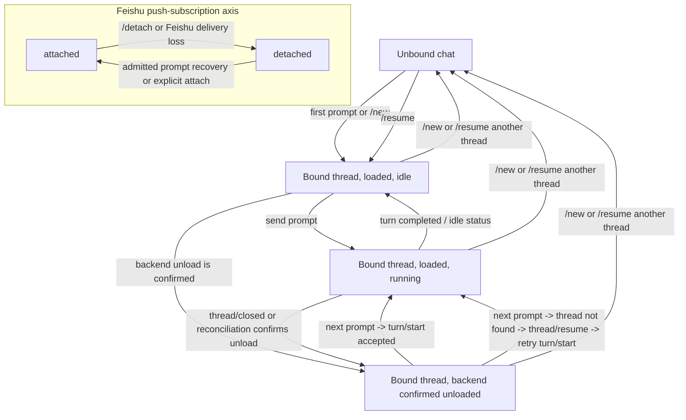

# Feishu Thread Lifecycle

Document role: synchronized English peer. Canonical Chinese: `docs/contracts/feishu-thread-lifecycle.zh-CN.md`.

This document defines the current thread lifecycle contract for the Feishu side.
It explains why Feishu must follow the same backend contract as `focus` /
`fcodex`, while still using a different runtime recovery model.

See also:

- `docs/architecture/focus-shared-backend-runtime.md`
- `docs/contracts/root-operation-owner.md`
- `docs/contracts/thread-resume-local-commit.md`
- `docs/contracts/runtime-control-surface.md`
- `docs/decisions/cross-instance-live-runtime-admission.md`
- `docs/contracts/thread-next-load-settings-semantics.md`
- `docs/contracts/thread-profile-semantics.md`

## 1. Historical Verified Baseline

- Upstream project: [`openai/codex`](https://github.com/openai/codex.git)
- Historical locally verified baseline for the source details below: `codex-cli 0.118.0`, resolved locally to upstream
  tag `rust-v0.118.0` (`b630ce9a4e754d35a1f33e4366ba638d18626142`) on
  2026-04-03
- If this document later needs specific upstream source references, prefer
  commit-pinned `openai/codex` permalinks against that baseline instead of
  developer-local checkout paths
- Current Web/multi-frontend contracts name their own investigation baseline;
  this historical pin must not be read as a current app-server compatibility
  claim.

## 2. Five State Axes That Must Not Be Confused

For one Feishu chat, the following are different facts:

1. `binding`
   - which `thread_id` this Feishu chat is logically attached to
2. `subscription`
   - whether the current live connection is still subscribed to that thread
3. `loaded runtime`
   - whether the thread is currently loaded in app-server memory
4. `running turn`
   - whether a turn is currently executing
5. `main-turn lease`
   - whether this Feishu binding holds the exact blank submission or active
     `turn_id` lease for the current main turn

The Feishu implementation uses `binding` as the chat-local source of truth.
`loaded runtime` is a recoverable runtime fact, not the binding fact.

In the current repo wording, Feishu now explicitly exposes this as the chat's
Feishu push attachment state:

- `attached`
  - the Feishu service is still subscribed to that thread
- `detached`
  - the binding remains, but this Feishu chat is no longer receiving push for
    that thread

This is only a stricter name for the `subscription` fact. It does not change
the requirement to keep it distinct from `binding` and `loaded runtime`.

For operational control, keep the main-turn lease separate from the
binding/runtime axes. `InteractionLeaseStore` is the sole cross-frontend fact:
blank means one submission is in flight, and a non-empty `turn_id` means one
exact main turn is active. A binding, attachment, shared backend, last
subscriber, card, or child thread neither grants nor extends that lease.

Approval and user-input actions use their own exact process-local request
capabilities. They do not become a second writer or delay matching main-turn
completion. `runtime-control-surface` continues to define Feishu
binding/attach/runtime axes only.

## 3. Why Feishu Cannot Copy the Local TUI Wrapper Literally

`focus` / `fcodex` normally keep one live remote session while the TUI process
stays open. That means:

- the websocket stays connected
- the current thread often stays subscribed
- the thread often remains loaded

Feishu is different:

- the Feishu user is not holding a long-lived TUI process
- the service-side remote connection can be interrupted independently
- a bound thread may become unloaded even though the Feishu chat should still
  continue that same thread later

Therefore Feishu must preserve the thread binding even after runtime loss, then
re-load the runtime when needed.

## 4. Feishu State Diagram

This diagram intentionally separates the binding/backend axis from the Feishu
push-subscription axis. `/detach` and Feishu delivery loss change only the
latter; they do not themselves prove that the backend unloaded. Conversely,
the last subscriber may eventually lead upstream to unload a thread, but only
adapter/app-server evidence may move the backend axis to `backend confirmed
unloaded`. Independent runtime-source facts may still require Focus to retain
runtime interest, so subscription cleanup must not guess that it can release
another owner's holder.

The diagram is not a main-turn lease or release diagram. The detailed
`bound + detached` prompt preflight and recovery rule is in Section 5.3 below.

The arrows that create, continue, or reload a live operation have an unshown
precondition: the current Feishu binding must first acquire the exact
submission/active-turn lease described by `root-operation-owner`. This diagram
only describes binding/runtime transitions after admission; a binding,
`thread/closed`, unload, or sole subscriber does not grant permission to
continue, resume, queue, or take over.

The sole method-specific exception attaches a detached Feishu binding midway
through an already-active direct-root turn. It establishes only an observer
subscription and exact execution anchor; it neither acquires nor transfers the
main-turn lease/writer. Both preflight and an immediate pre-send guard for
`thread/resume` must authoritatively confirm that the same root is still active.
Section 5.3.1 fixes the complete boundary.

### 4.1 Authoritative Feishu Delivery Loss

The Feishu application must subscribe to `im.chat.disbanded_v1` and
`im.chat.member.bot.deleted_v1`. The former proves that a chat was disbanded;
the latter proves that the bot was removed from that chat. Registering the
callbacks in code does not replace enabling both subscriptions in the developer
console. These events prove only that the Feishu destination is unreachable;
they do not prove that the backend thread unloaded or authorize another
frontend to take over an active main turn.

Before returning a successful ACK to Feishu, the callback must parse a nonempty
`event_id`, `chat_id`, and closed event type and write that exact event to the
durable inbox. An exact replay of the same fact is idempotent; reusing one event
id for another chat or type fails closed. Parse or durable-acceptance failure
must propagate to the SDK. The callback must not clear caches, remove a binding,
or swallow the failure before ACK.

The inbox has one canonical transition, `pending -> settled`. A dedicated
worker starts only after the RuntimeLoop and adapter, then uses the RuntimeLoop
to perform the exact chat's batch binding-owner removal, timer effects,
interaction fail-close, and transport-cache cleanup. Inbox enumeration is not
a service-startup precondition: an unreadable inbox degrades only destination
reconciliation, remains visible in operator status, and is retried by the
worker. It does not prevent Web, fcodex, the control plane, or unrelated Feishu
capabilities from starting. In contrast, a callback whose durable `accept`
fails still propagates failure to the SDK and must not ACK the proof.

The worker writes `settled` only after the replayable matching-chat stages
complete. A batch mutation, fail-close, cache cleanup, or settlement-write
failure preserves `pending` for retry, including after restart. Thread-runtime
unsubscribe and lease release after a committed binding removal are an
independent conservative consequence: when direct-root release cannot be
proved, Focus logs the condition and retains that runtime, but it does not roll
back the confirmed destination loss or create another cleanup state machine.
Shutdown closes and joins this worker before the RuntimeLoop drain barrier.
Operator status exposes its worker state, pending count, and latest error as
`feishu_destination_liveness`.

On one machine, only one Focus service may hold a long connection for a given
Feishu `app_id`. This lease provides no cross-machine coordination; running the
same `app_id` on multiple machines or in a cluster is unsupported because
Feishu may deliver an event to a process that does not own the local binding.

`FeishuOutboundGateway` owns message create, reply, and patch effects and
returns two independent classifications:

- effect: `confirmed`, `rejected`, or `unknown`
- destination liveness: `reachable`, `proven_unreachable`, or `unknown`

Only reviewed official error codes `230002` (the bot is outside the chat) and
`232009` (the chat was dissolved) prove permanent destination loss. A known
request rejection such as `230013` may prove that this call had no effect while
leaving destination liveness unknown. `230049`, an unreviewed/future code, a
timeout, a transport exception, or a nominally successful response without a
message id leaves both the relevant effect and destination liveness unknown. A
successful call proves only that the destination was reachable at that call;
it is not a durable liveness lease.

Event evidence and permanent outbound errors are normalized into one
`FeishuDestinationLossProof`. Its durable identity is
`proof_type + source_id`: an event uses its `event_id`, while an outbound proof
uses the exact attempt id. The proof ledger uses schema v2 and reads schema-v1
event records, migrating them on the next write. Operator status reports
`pending_proofs`, not an event-only count.

Create and reply requests carry their attempt id through Feishu's official
`uuid` field. An `unknown` outcome does not authorize an immediate fallback or
a second effect with a fresh UUID. An execution page may make at most one
reconciliation request with the same UUID, while live or from its immutable
pre-retirement snapshot. A confirmed response supplies the message id; a
rejected or still-unknown response stops that page path without another UUID.
Section 5.5 defines the complete page boundary.

## 5. Runtime Recovery Rules

### 5.1 Binding Survives Unload

If app-server unloads a thread because the last subscriber disappears, the
Feishu chat must keep:

- `current_thread_id`
- `current_thread_title`
- chat-local working directory and UI state

It must not treat `thread/closed` or `turn/start -> thread not found` as proof
that the logical chat binding should be cleared.

### 5.2 `thread/closed` Means Runtime Ended, Not Session Deleted

Upstream `thread/closed` is emitted after the thread is unloaded from memory.
It does not mean the persisted rollout vanished. A later `thread/resume` can
still restore it.

### 5.3 An Admitted Next Prompt May Reattach and Rehydrate the Runtime

When a Feishu chat has a bound `thread_id`, a `bound + detached` prompt uses
the same minimal main-turn rule as every other surface:

1. validate the exact binding/root and acquire that binding's blank submission
   lease before any `thread/resume` or `turn/start` leaves Focus;
2. if preflight or lease acquisition fails, reject without attaching, queuing,
   or sending upstream work;
3. call `thread/resume` when reattachment is needed. Because a persisted goal
   can continue after the ACK, keep one exact process-local continuation
   receipt tied to the same blank lease;
4. a known-success `turn/start` response preserves the authoritative upstream
   `turn.id`, but the response alone cannot activate or transfer a Focus lease
   or establish matching lifecycle/completion authority.
   Only the exact ordinary-prompt admission in the same
   `FeishuRootOperationController` may install a non-empty response id once as
   a process-local, one-shot interrupt candidate. Matching `turn/started` binds
   the actual `turn_id`, and matching completion releases an already-bound
   lease immediately. If the started notification is missed, completion cannot
   use the candidate to bind the blank. The same controller may settle its
   exact ordinary-prompt blank only after an authoritative reread proves the
   root inactive; that proof does not attribute any completion to the
   submission;
5. a known no-send/non-continuing result releases only the exact blank
   generation. An unknown result, or an accepted submission whose turn identity
   is not yet bound, keeps only that current-process submission for lifecycle
   reconciliation and is never replayed after restart.

An already attached binding normally tries official `turn/start` first. If upstream
returns the reviewed thread-not-loaded error, Focus may resume and retry once
under the same exact admission. This is a bounded recovery step, not writer
handoff.

Official `turn/start` is start-or-steer. It normally starts a new turn while
upstream is idle, but in the narrow ordering window Web, `fcodex`, or autonomous
goal continuation after resume may become active before the exact active-turn
fact reaches Feishu admission. The Feishu input and turn settings then join that
active regular turn. Upstream accepted the submission, so it neither enters the
FIFO nor gets resent. Focus normally waits for `turn/started` to bind the actual
turn id. If that notification is missed, the blank remains fail-closed; only an
authoritative inactive-root reread or exact thread terminal can settle it in
this process, without attributing a completion to the submission.

The same rule applies to `thread/goal/set` and any resume that may autonomously
start work. Objective-only, omitted-status, `active`, malformed, unrecognized,
and future goal statuses are treated as continuation-risk until a typed result
or lifecycle event proves otherwise. An explicit Feishu attach that does not
satisfy Section 5.3.1's narrow active-observer contract also follows this
ordinary lease-bearing path. Overlapping calls retain distinct process-local
receipts, so an older response cannot release a newer submission.

`FeishuRootOperationController` owns these opaque submission/continuation
receipts and no cross-restart writer state. Handler keeps no mirror map.
Another frontend's exact submission/active-turn lease blocks the call; a
binding, subscriber, card, child, or endpoint state cannot bypass that denial.
`/cancel` first uses the exact actual active `turn_id` held by this binding's
execution/lifecycle owner. Only while that actual id remains absent may it
exactly claim the one-shot candidate from the same ordinary-prompt admission.

### 5.3.1 Mid-Turn Active-Observer Attach

RuntimeAdmin may attach a detached Feishu binding to an already-running
direct-root turn, but this is neither writer handoff nor ordinary next-turn
admission. The narrow path is fixed as follows:

1. an attach initiated by a Feishu command or card still passes the existing
   inbound-actor admission first and, when entering the active-observer path,
   the existing group-`all` thread-exclusivity check. Trusted CLI/control
   attach retains its existing admission and gains no stronger global
   group-chat check from this feature. Authoritative preflight must then confirm
   a direct-root target that is currently active, and an exact pre-send guard
   must confirm that it is still active immediately before `thread/resume`
   leaves Focus. The request neither acquires nor transfers a main-turn lease
   and carries no next-turn model, reasoning, approval, or permissions
   override;
2. after the resume response arrives, one local callback inspects the snapshot
   and commits both the attached binding and execution anchor in the same
   shared-lock critical section. It establishes `active_observer` provenance
   only when the response contains exactly one `inProgress` turn whose `id` is
   one unique non-empty exact string;
3. if the turn completes between pre-send and response and the response is
   already idle, the race degrades deterministically to an ordinary attached
   binding: Focus fabricates no anchor and creates no observer execution/page
   provenance. If the response still reports active but cannot provide that
   sole exact turn id, local commit fails closed and the binding remains
   detached;
4. the observer page explicitly says that it joined after the turn began and
   that earlier progress may be incomplete. It bootstraps only available
   assistant text from the resume response and continues from live
   notifications after attach. Upstream does not promise replay of earlier
   command/tool deltas, and Focus does not reconstruct them;
5. the observer gains no cancel or approval/question-response authority over
   the existing turn. Upstream pending requests replayed after resume are
   neither shown to this observer nor automatically rejected; canonical pending
   authority remains with app-server and an existing exact surface capability;
6. under the shared lock, the local callback first stages a transient anchor in
   the still-detached resident and only then commits attached with one durable
   write. A failed write clears only the staged anchor and does not depend on a
   second store write for rollback;
7. ordinary Feishu messages, `turn/start`, next-turn settings, and Feishu FIFO
   remain unchanged. A matching terminal event—including a snapshot where the
   exact observer turn is terminal but a successor has already made aggregate
   thread status active—retires only this execution's `active_observer`
   provenance. The binding remains ordinarily attached, and a successor turn
   creates its own execution anchor through the existing ingress, writer, and
   FIFO rules.

This path solves only visibility when an active thread already exists but a
detached Feishu binding cannot receive its later notifications. It does not
promote subscriber, resume-response, card, or binding state into lifecycle or
control authority.

### 5.3.2 Explicit `/steer` Exact-Turn Contribution

Feishu interprets only explicit `/steer <non-empty text>` as a current-turn
contribution. Ordinary text, attachment messages, synthetic prompts, and FIFO
items never enter this path. Its complete boundary is:

1. the slash route retains existing inbound-actor and group-admin admission;
   immediately before the effect it also applies current chat/thread group-`all`
   exclusivity, but never reuses ordinary prompt writer denial that would reject
   a foreign writer;
2. the initial binding snapshot must be an attached, running direct-root mirror
   with non-empty exact `thread_id` and `turn_id`. `active_observer` provenance
   is explicitly eligible. A locally known `compact` execution is rejected;
   upstream-specific states such as review remain owned by the official typed
   `turn/steer` rejection;
3. the caller freezes `BindingExecutionTarget + thread_id + turn_id`, then
   authoritatively rereads the same direct root as active and captures the
   current positive backend connection generation. The last pre-effect check,
   under the shared lock, requires the binding handle, attached/running state,
   execution generation, thread, and turn to remain exact;
4. after every guard passes, call official
   `turn/steer(threadId, expectedTurnId, input)` exactly once, with only this
   text in `input`. The path acquires/releases no main-turn lease, enters no
   FIFO, creates no execution page, reads or consumes no attachment, carries no
   model/effort/approval/permissions/next-turn setting, and creates no successor
   turn;
5. a local guard, authoritative reread, connection-generation capture, or final
   exact recheck failure before dispatch explicitly reports “not sent and not
   queued.” An ordinary `CodexRpcError` is a known upstream rejection and
   explicitly reports “not added to the current turn.” Neither is retried;
6. transport loss, timeout, protocol/malformed response, or other non-typed
   exception after steer dispatch, plus a success response whose `turnId`
   differs from the frozen expected id, establish only unknown outcome. Report
   “possibly sent; result unknown,” with no automatic retry, history-based
   success inference, `turn/start` fallback, or successor retargeting;
7. only a typed success response with the same non-empty frozen `turnId`
   reports that the text was added. Success transfers no writer, cancel,
   approval, settings, goal, binding, or lifecycle authority.

This is bounded, non-persistent exact effect authority. Focus creates no
reservation, unknown journal, recovery worker, or exactly-once promise. A user
who explicitly invokes `/steer` again after an unknown outcome initiates a new
manual effect.

### 5.4 Live Notifications Are the Primary Runtime Truth

While Feishu is still subscribed, it uses live notifications for:

- streaming reply deltas
- command/file change logs
- approval requests
- terminal events

The active observer from Section 5.3.1 becomes a current subscriber only after
the binding/anchor callback commits successfully. It consumes only live
notifications available from that point onward. Assistant text bootstrapped
from the resume snapshot is bounded reconciliation, not proof that earlier
command/tool notifications were replayed.

On the Feishu side, `thread/read` is only a snapshot reconciliation tool. It is
not allowed to declare the current execution dead on its own.

The rules are:

- trust live notifications first while a turn is running
- when `turn/completed` matches the active main turn, first commit in-process
  retirement through the exact resident session and advance the binding FIFO;
  only then close execution cards asynchronously from the immutable
  pre-retirement snapshot. Card send/patch/pagination, `thread/read`, terminal
  result delivery, and image delivery are not turn lifecycle authority
- a local binding-persistence failure is reported, but it must not resurrect a
  retired main turn in the live process or block its FIFO
- use `thread/read` only as a background reconciliation pass to fill in final
  reply content, correct old cards, and confirm thread status. It consumes only
  immutable facts from the old turn and must not mutate a successor execution
  which may already be active
- if `thread/read` can identify the last textual `agentMessage`, and the
  authoritative terminal-result carrier has already been delivered, a later
  background patch may remove that last answer from the old execution page
- a `thread/read` timeout or transport error fails only that reconciliation
  attempt. It cannot roll back a committed turn completion or block the next
  prompt

Raw live increments for commands and file changes are runtime evidence, not
Feishu transcript content. For the exact active turn,
`item/commandExecution/outputDelta` and `item/fileChange/patchUpdated` still
refresh the heartbeat/watchdog and invalidate an older agent terminal
candidate when later work is observed. They do not enter `process_log` or
schedule a card patch on their own. A stale turn still has zero effect under
Section 5.5. Human-readable progress is derived only from item start and the
authoritative `item/completed` shape:

- command start shows cwd and command, each bounded to `1 KiB` of UTF-8 bytes;
  completion shows status, exit, and duration. Success keeps only the last
  non-empty `aggregatedOutput` line. A non-success status, including `failed`,
  `declined`, or a forward-unknown status, keeps at most the last four lines. The
  output candidate is bounded to about `2 KiB`
- file completion shows only the total change count, the first three paths
  bounded to `512 bytes` each, and the remaining count
- the projector measures remaining space against the complete current
  `process_log` UTF-8 byte size. Normal command/file summaries append only up
  to a `10 KiB` total; a non-success command diagnostic may append up to a
  `12 KiB` total. Fields, CRLF, and invalid Unicode are normalized at the
  projection boundary

These limits constrain only the display-only process panel on the Feishu
execution card. Web continues to show complete tool details from upstream item
history. The summary, truncation, and card patch remain outside turn lifecycle,
terminal-result, and external-effect authority.

Feishu uses the same process-local server-request boundary as Web and
`fcodex`. After an approval, question, automatic answer, or fail-close
response is accepted for dispatch, its card may render as handled. The
canonical request remains owned by upstream app-server; Focus keeps only the
current-connection `ServerRequestRegistry` identity and exact surface action
capability. Matching `serverRequest/resolved`, turn/thread lifecycle, or
connection retirement removes that local projection.

A successful UI update or socket write is not proof that upstream consumed the
response, but the pending request also does not extend the main-turn lease.
Matching `turn/completed` releases the writer immediately; upstream replay on
a later resume may rebuild any still-pending request projection.

Terminal notifications can still be missed after disconnects or ownership
transfers. Therefore the Feishu side also reconciles from `thread/read`:

- when terminal signals arrive
- when `thread/closed` arrives
- when a watchdog notices a running card has gone quiet for too long

Only the timer-triggered scheduled watchdog uses the following staged
boundary:

1. the timer callback only hands its exact watchdog ticket to a recovery
   worker tracked by the service shutdown barrier. RuntimeLoop consumes the
   ticket only while it is still the current registration, then its short
   prepare freezes an immutable recovery receipt: the exact resident execution
   target, the thread/turn/page and other execution fences, and the positive
   generation of the currently existing backend connection together with the
   exact online-observation revision of the current execution;
2. outside RuntimeLoop, the worker makes one `thread/read` using that
   generation. The read may use only the already-admitted same connection and
   must recheck its generation immediately before the actual send. It neither
   connects on demand nor silently crosses to a replacement backend. While the
   read is pending, RuntimeLoop must remain available for notifications and
   other short runtime transitions;
3. after the snapshot arrives, the worker returns to RuntimeLoop and settles
   through the original receipt under the same connection-generation guard. A
   replacement of the binding/runtime handle, thread, turn, page, prompt, or
   execution incarnation, any connection-generation change, or a newer
   notification advancing the online-observation revision while the read was
   pending makes the late snapshot a no-op; it may only try to reschedule the
   still-matching exact execution. The `thread/read` not-found fallback and a
   runtime-channel degraded settlement after timeout or disconnect pass
   through the same generation, execution-target, and observation settlement
   and cannot bypass those fences. If prepare cannot capture the complete
   generation/observation receipt, it may only try an exact reschedule and may
   not later write degraded unconditionally. Thread title and cwd are
   ancillary projection, so they are not part of the generation-guarded
   lifecycle settlement and cannot trigger local file I/O while that
   generation gate is held; ordinary notification/read paths continue to
   converge them;
4. an active snapshot may reschedule the watchdog only from the current exact
   session returned by settlement. For a terminal snapshot, RuntimeLoop first
   commits exact execution retirement, releases the main-turn writer, and
   drains the FIFO under the existing rules. Only after that commit returns may
   the worker present the old execution card, terminal result, and images
   outside RuntimeLoop from the immutable pre-retirement snapshot. Failure of
   those presentation effects cannot roll back retirement or affect a
   successor;
5. service shutdown first closes recovery-worker admission, requests
   cooperative stop, and waits for every registered worker. Once a worker
   observes the stop request, it must not settle a snapshot, present terminal
   output, or reschedule a watchdog. Only after the worker barrier completes
   may shutdown proceed to RuntimeLoop and adapter teardown.

This staged boundary changes only where the scheduled watchdog runs and how
its late results are fenced. Admission, effects, and settlement for ordinary
Feishu prompts, the FIFO, active-observer attach, and explicit `/steer` remain
unchanged.

### 5.5 Execution Card Anchor Contract

Main-turn retirement is one exact runtime transaction; terminal presentation
is not a second phase of that transaction. An ordinary ingress path may resolve
the canonical session only once. When a subscriber, interaction lease,
inventory, or receipt already supplies an exact binding, the caller passes that
resident `BindingSessionSnapshot` directly instead of reinterpreting it as
sender/chat ingress coordinates. Prepare, locked recheck, in-process anchor
retirement, and FIFO drain retain one `BindingRuntimeHandle` plus the expected
thread/turn/page fences. Replacement or owner-revision A -> B -> A fails closed
before the retirement commit. After commit, presentation consumes only the
immutable pre-retirement snapshot, so a successor turn, card-projection
failure, or binding-persistence failure cannot masquerade as rollback of the
committed runtime fact.

For a single Feishu chat, there may be at most one current execution page at a
time; long output may retain multiple sealed historical pages:

- the active execution is anchored by `prompt_message_id`, the current page,
  and `turn_id`. Only the active page may be updated or accept cancellation; a
  stale cancel action from a sealed page is rejected
- an active-observer execution takes its anchor directly from the sole
  non-empty `inProgress` turn id in the same running `thread/resume` response,
  never from a `turn/start` response turn id alone. Its observer provenance prevents the
  page from displaying or accepting cancel and prevents it from becoming an
  approval owner. Matching terminal retirement clears that provenance, and a
  successor execution does not inherit it
- every page has payload/component budgets, a contiguous transcript cursor,
  and a stable outbound UUID. When new content no longer fits, Focus seals the
  active page and creates the next page from the next cursor range without
  duplicating or skipping projected content
- an unknown send outcome freezes or reconciles only that exact page effect.
  Focus may issue at most one reconciliation request with the same UUID; it
  never switches to a fresh UUID for that effect and does not freeze the
  transcript, Codex turn, other pages, or whole binding. An unknown or
  explicitly rejected initial-page send does not prevent an accepted prompt
  from calling `turn/start`; rejection discards only that page, while unknown
  retains only its exact reconciliation fact
- a live notification's `thread_id` only selects candidate bindings;
  turn-scoped notifications must carry `turn_id`, and that `turn_id` must match
  the local active execution anchor before the notification may mutate the
  execution card, transcript, plan, heartbeat/watchdog, or terminal finalization
- thread-level notifications such as status, close, title, and goal updates may
  omit `turn_id`, but they may refresh the active execution heartbeat only after
  the candidate binding still confirms the same current `thread_id`
- the same `turn_id` check also gates the active execution heartbeat/watchdog:
  stale same-thread notifications may prove that the backend is alive, but they
  must not refresh the current card's `last_runtime_event_at` or postpone its
  watchdog reconciliation
- a normal prompt's `turn/start` response carries the authoritative upstream
  `turn.id`. Until matching `turn/started` arrives, the local execution anchor
  still does not activate Focus lifecycle identity from the response alone. The response cannot enter general exact-turn cancellation or
  lifecycle authority, update an exact-turn card, or establish a FIFO terminal
  fence; only the root admission owner may hold Section 5.3's one-shot interrupt
  candidate. If `turn/started` was missed, completion cannot use that candidate
  to bind or finalize the anchor. The exact process-local admission token
  from Section 5.3 permits only an authoritative inactive-root reread to settle
  the same binding's still-unreplaced ordinary-prompt blank and anchor, without
  assigning any completion to it
- for operations such as `/compact`, whose upstream request returns immediately
  and whose `turn_id` is only learned from later notifications, the local
  execution card is in an "unbound turn identity" state while
  `awaiting_local_turn_started` is true and `turn_id` is still empty;
  `turn/started` is the primary binding point. If that notification is missed,
  only a `contextCompaction` `item/started` notification may bind the `turn_id`
  to the active anchor, and only when the active anchor is explicitly marked as
  `/compact`. Other item/delta/completed events, `turn/completed`,
  `thread/status=idle`, `thread/closed`, and watchdog snapshots must not
  finalize the card or advance the binding FIFO on their own
- if an unbound `/compact` anchor receives neither `turn/started` nor the
  `contextCompaction item/started` fallback before
  `compact_start_timeout_seconds`, local state is explicitly unknown. The Feishu
  side closes the card with an "unconfirmed state" message and does not retry.
  This process keeps only that exact blank submission and binding execution
  anchor until an exact turn lifecycle event binds it or an authoritative idle
  read proves that no main turn remains. It does not persist a quarantine or
  block another thread, binding, or descendant.
- `/cancel`, generic card cleanup, binding changes, and stale terminal evidence
  cannot claim that an unknown compact succeeded or safely replay it. There is
  no operator-stop or tree-stop recovery path; matching lifecycle reconciliation
  consumes the process-local receipt and ordinary main-turn settlement resumes
  the binding FIFO. See [`root-operation-owner.md`](root-operation-owner.md).
- live deltas, terminal notifications, and watchdog reconciliation may only
  update that active card
- matching main `turn/completed` immediately clears running/current-turn state
  and advances the FIFO. Feishu neither queries nor waits for spawned children;
  their lifecycle and results remain owned by upstream app-server and do not
  enter the Feishu execution runtime. Retirement is immediate even while an
  opening/`send_unknown` page, terminal carrier, or background reconciliation
  remains. A known active
  page is sealed at retirement; a pending page is removed from the resident
  runtime. Detached terminal presentation may reconcile a `send_unknown` page
  once with the original UUID from the immutable pre-retirement snapshot. A
  confirmed result may finish terminal pagination; rejected or still-unknown
  stops without a fresh-UUID fallback. None of these effects writes into a
  successor binding runtime
- once an execution is authoritatively settled and finalized without an
  execution-settlement fence, the current page stops being the active anchor;
  visually
  closing an indeterminate compact card does not retire its fenced anchor
- if terminal reconciliation still needs to fill in missing text later, it may
  patch an old page by its `card_message_id` or, when no unresolved page effect
  remains, create a detached terminal page with a fresh UUID; neither path
  mutates the current binding runtime
- the authoritative terminal result should normally be sent through a separate
  `terminal result card`; only when that carrier cannot represent the text
  safely or within budget may the system fall back to plain text
- for an exact turn, whether evidence arrives through matching live
  `item/completed` or `thread/read`, only the last completion-shaped valid
  `agentMessage` is a candidate for agent terminal text. A missing, `null`, or
  non-string `text` is unavailable rather than explicitly empty. Codex 0.147
  [`MessagePhase`](https://github.com/openai/codex/blob/be6e8eac029b183056b7e4402879f15d2c85f61b/codex-rs/protocol/src/models.rs#L765-L778)
  is exposed by app-server's [`ThreadItem::AgentMessage.phase`](https://github.com/openai/codex/blob/be6e8eac029b183056b7e4402879f15d2c85f61b/codex-rs/app-server-protocol/src/protocol/v2/item.rs#L242-L247):
  explicit `commentary` updates process display but is never a terminal
  candidate, explicit `final_answer` is a candidate, and only a missing or
  `null` phase retains the legacy provider-compatible ordering fallback. If
  the last candidate is followed by root reasoning/plan, command/file/MCP
  work, a dynamic or collaboration tool, image view, sleep, context
  compaction, or a review-mode boundary from Codex
  0.147 [`ThreadItem`](https://github.com/openai/codex/blob/be6e8eac029b183056b7e4402879f15d2c85f61b/codex-rs/app-server-protocol/src/protocol/v2/item.rs#L226-L391),
  that candidate is invalidated. `subAgentActivity` participates in this
  terminal-text check only when it is already present in evidence for that
  root turn; it creates no independent child-lifecycle projection. It, an
  independent `imageGeneration`, and the turn-diff projection near terminal do
  not by themselves prove that the root has more textual work. If the last
  valid message is explicitly empty, earlier commentary or staged replies may
  remain on the execution card as process display but must not be promoted to
  the final answer. A missing exact turn or unavailable terminal evidence must
  not borrow a reply from another turn
- if the upstream first emits a non-retry `error` notification and that turn
  ultimately produces no non-empty textual `agentMessage`, the local runtime
  retains that error message as the turn's fail-closed textual close-out. A
  later authoritative non-empty agent final wins. Terminal text precedence is:
  non-empty agent final, non-retry error, explicit empty agent final, unavailable
- when no such fail-closed error exists, an explicitly empty `agentMessage`, or
  terminal evidence that remains unavailable after the existing bounded
  snapshot reread, closes the execution card and appends the local display
  explanation `本轮未生成有效终态回复`. That explanation is not upstream terminal
  text, does not enter the terminal-result carrier/store, does not block
  main-turn retirement or FIFO, and does not replay or automatically retry the
  turn
- the old execution card may remove terminal text only after the authoritative
  terminal-result carrier has been delivered successfully and the target's
  original character interval is proven to be the page-source transcript's last
  assistant segment. A matching live `item/completed` records the upstream item
  ID, unrevised raw text, and original `[start, end)`. When the selected snapshot
  final has the same non-empty item ID and exactly the same raw text, cleanup uses
  that page-source coordinate even if the snapshot reply-segment shape differs.
  Without that same-item proof, the snapshot path must prove that captured/live
  and full-snapshot reply-segment structures are equal and take the interval from
  the last segment of the unreflowed projection
- cleanup uses only the confirmed page receipts returned by detached
  finalization and patches every page whose original cursor intersects that
  interval. Receipt message IDs must be unique and adjacent cursors contiguous.
  Cleanup must not repaginate, reflow, shorten cursors, or guess the final by
  substring search/replacement or fuzzy matching. A non-intersecting page is
  refreshed with its original content and cursor only when terminal display
  status such as interrupted/cancelled changes
- if carrier delivery fails, item identity or raw text differs, or the local
  coordinate is unavailable and the structural fallback also fails, every
  execution page keeps the final reply. If confirmed receipts cover only a
  prefix of the interval, only confirmed intersecting pages may be patched at
  their exact coordinates; uncovered pages honestly retain duplication. A patch
  failure may leave display duplication on that page only; later intersecting
  pages are still patched independently, and the failure does not change
  terminal authority, main-turn retirement, or the FIFO
- a running execution card expands its reply panel by default; completed and
  sealed pages collapse it by default so the independent terminal-result
  carrier remains the primary presentation
- if removing that final answer leaves the old execution card with no visible
  process log or staged reply content, the old card should be finalized as a
  minimal terminal card instead of being deleted; that minimal card currently
  renders a single `无` placeholder
- display-only execution-card markdown must neutralize raw HTML/XML outside
  fenced code and closed inline-code spans before it reaches Feishu; valid URI
  and email autolinks are reduced to their target text without angle brackets.
  If Feishu still rejects a full terminal execution-card payload as invalid
  content, Focus retries once with the same minimal terminal card so stale
  running controls do not remain visible
- a successful minimal terminal execution-card patch proves only that the stale
  running UI was closed; it does not prove that the omitted terminal text was
  delivered. Synchronous failure paths without an independent terminal-result
  carrier must still send that text through the existing idempotent follow-up
  path
- if the minimal fallback is rate-limited, the patch dispatcher retries the
  minimal model rather than the already rejected full model; a newer submitted
  model still takes precedence over that pending retry
- generated images discovered from the terminal thread snapshot are delivered
  only as separate follow-up Feishu image messages, after the authoritative
  text terminal result has been sent successfully when such text exists; they
  are not patched into the execution card and do not change the execution-card
  anchor contract
- if later reconciliation discovers a different authoritative
  `final_reply_text`, the system must emit a corrected terminal-result carrier
  again instead of only patching the old execution card
- that terminal-result delivery path does not reopen the execution anchor and
  does not weaken the "at most one active execution card" rule
- Feishu does not separately project spawned-child lifecycle or results, observe
  child threads, recover child history, redeliver late-child notices, or offer
  direct writes to `ThreadSpawn` children. Child-related facts are shown only
  when upstream has already incorporated them into the ordinary parent/root
  turn transcript or final output. A late result may be lost after the direct
  parent leaves the current `ThreadManager` or app-server exits. Child
  activity/results never patch or reopen old execution pages and never occupy
  a successor main turn
- after main-turn retirement, a new local prompt or external turn may create
  the next execution page immediately while detached presentation for the old
  turn continues
- the local reply-length budget for the execution card constrains only the
  display-only reply projection; the truncation notice itself must count
  against that budget rather than being appended outside it

Therefore a soft `thread/read` failure must never clear the current anchor and
then let later notifications create a second card for the same execution.

The binding FIFO is owned by `FeishuExecutionQueueController`; its cross-owner
drain order is owned by `FeishuExecutionQueueService`. It does not weaken the
"one active execution card" rule or grant writer authority.
Queued prompts or `/compact` items may only dequeue after the current execution
anchor retires. When `/compact` dequeues or starts immediately, it must establish
a local execution anchor before calling upstream `thread/compact/start`. FIFO
admission details are defined by `docs/contracts/scheduled-prompts.md`. Until
that anchor has learned its upstream `turn_id`, stale terminal signals from an
older turn must not let later prompts pass through the compact operation. Only
`turn/started` or the `/compact`-specific `contextCompaction item/started`
fallback may bind the anchor before a later `turn/completed` can finalize it.
Before an item actually dequeues, it must recheck the exact binding/root/epoch
identity and acquire the ordinary blank main-turn lease. A queued item owns no
writer authority, so a binding or root change cannot turn the FIFO into a write
bypass. Every ordinary Feishu prompt that reaches Codex--immediate ingress, FIFO
dequeue, and synthetic scheduled ingress alike--uses official `turn/start`. It
normally starts a new turn while upstream is idle. In the narrow race where
Web, `fcodex`, or autonomous goal continuation after resume becomes active
first, upstream adds the Feishu input and turn settings to that active regular
turn. The response preserves the authoritative upstream `turn.id`, but Focus
still waits for `turn/started` to activate the local lease/execution lifecycle.
`/compact` remains a separate operation.

A normal Feishu prompt may enqueue as one exact binding's next-turn input
without changing the current writer, settings, or destination. Besides the
binding's own exact execution anchor and existing same-binding/root/epoch continuity,
admission recognizes only these narrow lifecycle proofs:

- an exact non-empty turn already mirrored into that active/attached binding,
  including an autonomous turn for which no main-turn lease exists;
- a current-process Web/`fcodex` turn or autonomous goal turn proven before its
  Feishu mirror, with the exact thread/turn re-read unchanged under the shared
  binding lock.

Writer denial, a `turn/start` response, its returned `turn.id`, or the absence of a
locally visible lease does not establish FIFO continuity. Without the proofs
above, a normal prompt attempts `turn/start` directly. Input joined to an active
regular turn by the race already has an upstream effect and cannot be rewritten
as a queued item or resent automatically.

At most one Feishu binding may retain FIFO continuity for one root. Another
binding, a foreign/stale process lease, blank or mismatched turn evidence,
`/compact`, and group `all` exclusivity are never bypassed. Same-binding items
retain FIFO order within the exact root epoch. Only matching lifecycle terminal
settlement runs the existing retire/release/FIFO-drain chain; there is no timer,
scheduler, spin, persisted retry, or automatic resend. Unknown start outcomes,
owner-settlement failure, or anchor-retirement failure remain blocked and must
not create or advance FIFO continuity.

### 5.6 Recalled Queued Messages

Feishu message recall is a queue-admission signal, not a running-turn control
signal:

- if the service receives `im.message.recalled_v1` for a message that is still
  waiting in the Feishu execution FIFO, that queued item must be removed before
  it can dequeue
- an unclaimed queued item holds no main-turn lease, so removing it needs no
  writer release. A recalled head which is already claimed is settled once by
  its exact drain receipt, never by both queue and execution paths
- if the message has already dequeued and the prompt has been sent to
  app-server, recall must not automatically cancel the running turn; users
  should use `/cancel` or the execution-card cancel action
- deleting a message in the client is not a reliable cancellation signal unless
  Feishu also emits a recall event that the bot receives
- this behavior requires the Feishu app to subscribe to
  `im.message.recalled_v1`; without that event, queued prompts remain governed
  by the normal FIFO contract

The repository deliberately does not add a freshness gate for delayed receive
events in this contract. A late receive event is still admitted normally unless
it is cancelled by a received recall event before it dequeues.

### 5.7 Cancel Selection and Dispatch Outcomes

`/cancel` and the execution-card cancel action use one actual-ID-first path and
distinguish not-sent, possibly-sent, and matching-terminal evidence:

- a non-empty actual live id already held by the execution/lifecycle owner is
  mandatory when present, and no candidate is claimed. Only when the actual id
  is absent may Focus atomically claim the response candidate once from the
  exact prompt admission for the same binding/root; claim immediately empties
  the owner slot. With neither id, Focus sends nothing, retains local pending
  cancel intent, reports that this call did not cancel, and never says "stop
  requested"
- a direct-root read, policy check, transport call, or timeout that fails before
  the audit/adapter dispatch is wrapped as typed `CodexRpcPreSendError`. Only an
  exact typed pre-send failure whose method is `turn/interrupt`, while the same
  admission/claim remains current, restores the candidate and pending intent,
  degrades the runtime channel, and asks for a later explicit retry. An audit
  attempt alone does not prove send
- lifecycle-driven automatic cancel likewise clears pending before the
  possibly-sent boundary. Only typed pre-send restores it; a known response or
  post-dispatch unknown does not. A consumed candidate or cleared pending fact
  therefore cannot dispatch again on later `turn/started` or explicit
  `/cancel`
- a known upstream exact-ID rejection means this call did not cancel, consumes
  the candidate, and is never retargeted to a successor turn. Timeout,
  transport, or protocol uncertainty after dispatch is reported as "possibly
  sent, result unknown" and also consumes the candidate
- a successful `turn/interrupt` RPC `{}` proves only that the request crossed
  the dispatch boundary and the target later became terminal; it does not prove
  that work stopped. Pending intent, audit, and RPC success do not set
  `cancelled`. Only after lifecycle has bound the actual turn identity does
  matching `turn/completed.status=interrupted` set `cancelled=true`; a natural
  terminal keeps its actual status

### 5.8 Confirmed-stop Backend Epoch Retirement

Only after the owned child has completed OS process exit/wait may backend reset
ask `FeishuRootOperationController` to idempotently retire the old backend's
process-local admissions, continuations, interrupt candidates and in-flight
claims, plus its pending-admission and local-holder indexes. That retirement
preserves the issuer and every monotonic nonce, each root's continuation
generation high-water, and existing owner-loss reservations. Old tokens,
receipts, and claims cannot act on the replacement backend.

This owner neither scans nor releases shared `InteractionLease` records. In the
same reset transaction, `InteractionLeaseStore` captures current-process exact
full records before stop and centrally retires them by full-record CAS after
confirmed stop; other PIDs, PID zero, and successor generations installed after
capture remain untouched. If any authoritative retirement fails, ingress stays
fenced and Focus neither starts a replacement nor returns success; retrying this
owner-local retirement is idempotent. In the same confirmed-stop stage,
`InteractionRequestController` retires the old epoch's Feishu request and
response-action authority. Later card updates are only a best-effort projection;
they cannot decide retirement success or fabricate upstream resolution. Binding,
FIFO, and final card presentation do not gain or replace backend lifecycle
authority from this retirement.

## 6. Relationship With `focus` / `fcodex`

`focus` / `fcodex` and Feishu still share the same backend contract:

- same shared app-server
- same persisted thread ids
- the same `thread/resume` and official `turn/start` start-or-steer semantics

That only eliminates a backend fork; the same backend does not authorize a
shared writer. Writable actions, interaction responses, and disconnect
settlement for each root still follow `root-operation-owner`.

What differs is only the client-side runtime model:

- `focus` / `fcodex` usually stay attached while the TUI is alive
- Feishu must recover from a bound-but-unloaded state more often

So the rule is:

- same protocol contract
- different front-end recovery strategy

## 7. Lifecycle Contract Fixed Here

This document only fixes the contract boundaries that belong to the
thread-lifecycle layer itself:

- one Feishu chat keeps one logical current thread binding
- runtime loss does not clear binding automatically
- `thread/closed` is handled as a runtime transition, not a logical unbind
- `thread/read` timeout/transport errors only degrade the runtime channel; they
  do not immediately declare runtime loss
- outbound effect and destination liveness are independent state axes; only
  the two reviewed permanent codes or the two subscribed events create a
  destination-loss proof
- one Feishu chat has at most one active execution card at a time
- ordinary Feishu prompts use official `turn/start`: it normally starts a new
  turn while idle and may join an active regular turn in the narrow race. Exact
  FIFO continuity is single-binding, same-root/epoch ordered, and
  matching-terminal-only woken
- a detached Feishu binding may become a read-only active observer through a
  running `thread/resume` with an exact active pre-send guard. The binding and
  sole exact active-turn anchor commit in one local callback; an idle response
  race degrades to ordinary attached, while an unanchorable active response
  fails closed
- an active observer receives only post-attach live progress and explicitly
  discloses that history may be incomplete. It gains no cancel, approval, or
  pending-request replay authority and changes neither ordinary prompts,
  next-turn settings, nor FIFO
- only explicit `/steer <text>` may send one plain-text contribution to the
  exact active turn mirrored by the current attached/running binding. A known
  failure adds nothing; an unknown after dispatch is never retried, fallen back,
  or retargeted, and ordinary messages, attachments, FIFO, and settings remain
  unchanged
- `/new` and `/resume` explicitly replace the binding
- this document's binding/runtime recovery rules do not independently grant a
  writer; all writes, interactions, and release first obey
  `docs/contracts/root-operation-owner.md`

The following rules are closely related, but their formal ownership lives
elsewhere:

- preflight, pure-reject, and automatic attach/recovery rules for prompts on
  `bound + detached` bindings: Section 5.3 of this document
- thread-wise next-load setting semantics on unloaded-thread restore paths:
  `docs/contracts/thread-next-load-settings-semantics.md`
- command semantics for `/threads`, `/resume`, `/archive`, and local `focus` /
  `fcodex` continuation:
  `docs/contracts/thread-profile-semantics.md`
- group-chat binding-by-`chat_id` and group session-scope rules:
  `docs/contracts/group-chat-contract.md`
- cross-frontend main-turn writer and exact completion release:
  `docs/contracts/root-operation-owner.md`
- upstream-owned child lifecycle/results, direct-child writes, parent-history
  Tasks, and cold-resume boundaries:
  `docs/contracts/subagent-observation-and-recovery.md`

## 8. Relevant Files

- `bot/codex_handler.py`
- `bot/focus_runtime/runtime.py`
- `bot/feishu_outbound.py`
- `bot/feishu_destination_liveness_contract.py`
- `bot/feishu_destination_liveness.py`
- `bot/stores/feishu_destination_loss_store.py`
- `bot/stores/feishu_app_connection_lease.py`
- `bot/adapters/codex_app_server.py`
- `bot/prompt_turn_entry_controller.py`
- `bot/feishu_active_observer.py`
- `bot/feishu_turn_steer.py`
- `bot/feishu_thread_session_coordinator.py`
- `bot/focus_runtime/feishu_thread_session_composition.py`
- `bot/binding_execution_runtime.py`
- `bot/feishu_binding_transition.py`
- `bot/runtime_admin/binding_application.py`
- `bot/feishu_execution_start_contract.py`
- `bot/feishu_execution_queue.py`
- `bot/feishu_execution_queue_service.py`
- `bot/thread_access_policy.py`
- `bot/generated_image_delivery.py`
- `bot/stores/generated_image_delivery_store.py`
- `bot/fcodex/cli.py`
- `bot/fcodex/proxy.py`
- `docs/architecture/focus-shared-backend-runtime.md`
- `docs/decisions/cross-instance-live-runtime-admission.md`
