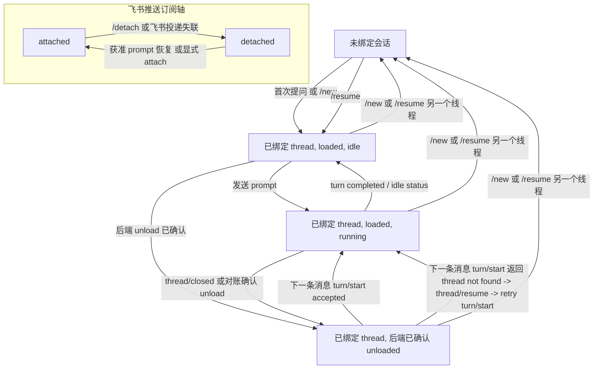

# 飞书侧线程生命周期

文档角色：中文规范源。英文同步副本：`docs/contracts/feishu-thread-lifecycle.md`。

本文定义飞书侧当前的线程生命周期合同。它解释了：为什么 Feishu 侧必须遵守和 `focus` / `fcodex`
相同的 backend 协议合同，但运行时恢复策略不能照搬本地 TUI wrapper。

另见：

- `docs/architecture/focus-shared-backend-runtime.zh-CN.md`
- `docs/contracts/root-operation-owner.zh-CN.md`
- `docs/contracts/thread-resume-local-commit.zh-CN.md`
- `docs/contracts/runtime-control-surface.zh-CN.md`
- `docs/decisions/cross-instance-live-runtime-admission.zh-CN.md`
- `docs/contracts/thread-next-load-settings-semantics.zh-CN.md`
- `docs/contracts/thread-profile-semantics.zh-CN.md`

## 1. 历史验证基线

- 上游项目：[`openai/codex`](https://github.com/openai/codex.git)
- 下文源码细节的历史本地验证基线：`codex-cli 0.118.0`，本地可解析到上游 tag
  `rust-v0.118.0`（commit
  `b630ce9a4e754d35a1f33e4366ba638d18626142`），核对日期为 2026-04-03
- 如果本文后续需要引用具体上游源码位置，应优先使用绑定到该基线
  commit 的 `openai/codex` permalink，而不是开发者本机 checkout 路径
- 当前 Web/多前端合同会注明各自调查基线；本历史 pin 不得被理解为当前 app-server 兼容性的声明。

## 2. 必须严格区分的五条状态轴

对一个飞书会话而言，下列事实不是一回事：

1. `binding`
   - 这个飞书会话逻辑上当前绑定到哪个 `thread_id`
2. `subscription`
   - 当前 live 连接是否仍在订阅这个 thread
3. `loaded runtime`
   - 这个 thread 当前是否仍加载在 app-server 内存里
4. `running turn`
   - 当前是否有 turn 正在执行
5. `main-turn lease`
   - 当前飞书 binding 是否持有本次 main turn 的 exact blank submission lease 或 active `turn_id` lease

飞书侧以 `binding` 作为“这个会话当前接着哪个线程继续聊”的事实来源。
`loaded runtime` 只是一个可恢复的运行态事实，不是绑定事实。

从当前版本起，飞书面对外把这层事实明确收紧为“飞书推送附着态”：

- `attached`
  - 飞书服务当前仍订阅这个 thread
- `detached`
  - binding 还在，但当前飞书会话已不再接收这个 thread 的推送

这只是对 `subscription` 的显式命名收紧，不改变它与 `binding` / `loaded runtime`
必须严格区分的合同。

在运行控制层面，还必须把 main-turn lease 与 binding/runtime 状态轴区分开。
`InteractionLeaseStore` 是唯一跨前端事实：空 `turn_id` 表示一笔 submission 正在发送，非空
`turn_id` 表示一个 exact main turn active。binding、attached、同一 backend、“最后一个 subscriber”、
卡片或 child thread 都不能授予或延长这份 lease。

审批与补充输入使用各自 exact、进程内 request capability；它们不是第二个 writer，也不能延迟 matching
main-turn completion。`runtime-control-surface` 仍只定义飞书 binding/attach/runtime 轴。

## 3. 为什么飞书侧不能照搬本地 TUI wrapper

`focus` / `fcodex` 在正常使用时，通常会维持一个持续存在的 remote TUI 会话。因此：

- websocket 连接通常持续存在
- 当前 thread 往往持续处于订阅状态
- thread 往往也持续保持 loaded

飞书侧不是这样：

- 飞书用户并不持有一个长寿命 TUI 进程
- service 侧 remote 连接可能独立于聊天窗口而中断
- 某个飞书会话明明还应继续同一个 thread，但这个 thread 的 runtime 可能已经被 unload

所以，飞书侧必须在 runtime 丢失后继续保留线程绑定，并在需要时按绑定去恢复 runtime。

## 4. 飞书侧状态图

这张图刻意把 binding/backend 轴和飞书推送订阅轴分开。`/detach` 与飞书投递失联只改变后者；它们本身不能
证明 backend 已经 unload。反过来，最后一个订阅者离开后上游可能最终 unload thread，但只有 adapter/app-server
证据才能让 backend 轴进入“后端已确认 unloaded”。其他 owner 的独立 runtime-source fact 仍可能要求 Focus
保留 runtime interest，因此订阅清理不能猜测并释放另一 owner 的 holder。

这张图不表达 main-turn lease 或 release。`bound + detached` 下 prompt 的预检与恢复细则见下文第 5.3 节。

图中会创建、继续或重新 load live operation 的箭头还有一项未画出的前置条件：当前飞书 binding 必须
先取得 `root-operation-owner` 定义的 exact submission/active-turn lease。此图只描述准入后的
binding/runtime 迁移；它不因 binding 存在、`thread/closed`、unload 或唯一 subscriber 而授予继续、
resume、排队或接管权限。

唯一的 method-specific 例外，是把 detached 飞书 binding 中途附着到已经 active 的 direct-root turn：
它只建立 observer subscription 与 exact execution anchor，不取得、不转移 main-turn lease/writer。
这条例外必须在 preflight 与 `thread/resume` immediate pre-send 两处都权威确认同一 root 仍 active；
完整边界见第 5.3.1 节。

### 4.1 飞书权威投递失联

飞书应用必须订阅 `im.chat.disbanded_v1` 与 `im.chat.member.bot.deleted_v1`。前者证明群聊已经解散，
后者证明机器人已经被移出该群；代码注册 callback 不能替代开发者后台订阅。这两个事件只证明飞书
destination 已不可达，不证明 backend thread 已 unload，也不授权另一 frontend 接管 active main turn。

callback 必须解析非空 `event_id`、`chat_id` 与封闭 event type，并在向飞书返回成功 ACK 前把 exact event
写入 durable inbox。相同 `event_id` 的相同事实可幂等重放；同一 id 对应不同 chat/type 时 fail closed。
解析或 durable acceptance 失败必须向 SDK 返回失败，不能先清 cache、删除 binding 或吞异常后 ACK。

inbox 的 canonical 状态只有 `pending -> settled`。独立 worker 在 RuntimeLoop 与 adapter 启动后开始，
通过 RuntimeLoop 完成 exact chat 的批量 binding owner removal、timer effect、interaction fail-close 与
transport cache cleanup。枚举 inbox 不是 service startup 的前置条件：inbox 暂时不可读时，只把
destination reconciliation 标为 degraded，由 worker 持续重试并通过 operator status 报告；Web、fcodex、
control plane 与其他飞书能力仍可启动。相反，callback 的 durable `accept` 失败仍必须向 SDK 传播，不能 ACK
一笔尚未接受的 proof。

全部可重放的 matching-chat 阶段完成后才写入 `settled`。batch mutation、fail-close、cache cleanup 或
settlement write 失败时保留 `pending` 并重试，重启后也继续处理。binding 已提交移除后的 thread runtime
unsubscribe / lease release 是独立的保守 consequence：无法证明 direct-root release 时记录告警并保留该
runtime，但不回滚已确认的 destination loss，也不再建立一套 cleanup 状态机。停机先关闭并 join 该 worker，
再进入 RuntimeLoop drain barrier；operator status 通过 `feishu_destination_liveness` 暴露 worker、pending 数与最近错误。

同一台机器上，同一个飞书 `app_id` 只能由一个 Focus service 持有长连接 lease。该 lease 不提供跨机器
coordination；同一 `app_id` 的多机或集群并行部署不受支持，因为飞书可能把事件随机投递给不持有本地
binding 的进程。

`FeishuOutboundGateway` 统一持有消息 create、reply 与 patch effect，并返回两条互相独立的分类轴：

- effect：`confirmed`、`rejected` 或 `unknown`；
- destination liveness：`reachable`、`proven_unreachable` 或 `unknown`。

只有已审查的官方错误码 `230002`（机器人不在群中）与 `232009`（群已解散）能证明永久失联。类似
`230013` 的已知请求拒绝可以证明本次调用没有 effect，但 destination liveness 仍是 unknown。`230049`、
未经审查/未来错误码、timeout、transport exception，或成功响应缺少 message id 时，相关 effect 与
destination liveness 都保持 unknown。成功调用也只证明调用当时 reachable，不形成持久 liveness lease。

事件证据与永久 outbound 错误统一归一为 `FeishuDestinationLossProof`，其 durable identity 是
`proof_type + source_id`：事件使用 `event_id`，outbound proof 使用 exact attempt id。proof ledger 使用
schema v2，可读取 schema-v1 event record，并在下一次写入时完成迁移；operator status 报告
`pending_proofs`，不再使用 event-only 计数。

create 与 reply 请求把 attempt id 写入飞书官方 `uuid` 字段。`unknown` 不授权立即 fallback，也不授权换一个
新 UUID 发起第二个 effect。execution page 无论仍 live，还是已经由 immutable pre-retirement snapshot 接管，
都最多只用原 UUID 发起一次对账：confirmed 后取得 message id；rejected 或仍 unknown 时停止该 page 路径，
不再换 UUID。完整 page 边界见第 5.5 节。

## 5. 运行时恢复规则

### 5.1 unload 不等于解绑

如果 app-server 因“最后一个订阅者离开”而 unload 某个 thread，飞书侧仍必须保留：

- `current_thread_id`
- `current_thread_title`
- 这个飞书会话当前目录等本地状态

不能把 `thread/closed` 或 `turn/start -> thread not found` 直接当成“这个会话不再绑定任何线程”的证据。

### 5.2 `thread/closed` 只表示 runtime 结束

上游 `thread/closed` 的语义，是 thread 已从 app-server 内存中卸下。
它不表示持久化 rollout 已消失。只要 rollout 还在，后续仍可 `thread/resume`。

### 5.3 已获准的下一条消息可以重新 attach 并重新 load runtime

飞书会话已有 `thread_id` 时，`bound + detached` prompt 与其他前端使用同一条最小
main-turn 规则：

1. 任何 `thread/resume` 或 `turn/start` 离开 Focus 前，先核验 exact binding/root，并为该
   binding 取得 blank submission lease；
2. preflight 或 lease acquisition 失败时直接拒绝，不 attach、不入队，也不发送上游工作；
3. 需要重新附着时调用 `thread/resume`。persisted goal 可能在 ACK 后继续，因此只保留一份与
   同一 blank lease 绑定的 exact、进程内 continuation receipt；
4. `turn/start` known-success response 保留 upstream authoritative `turn.id`，但 response 本身
   不能激活或转移 Focus lease，也不建立 matching lifecycle/completion authority；同一 `FeishuRootOperationController` 的 exact ordinary-prompt admission
   只可将非空 response id 安装一次为 process-local、one-shot interrupt candidate。matching
   `turn/started` 才绑定 actual `turn_id`，matching completion 立即释放已绑定 lease。若 started
   通知遗漏，completion 不能借 candidate 绑定 blank；同一 controller 只能在权威重读 root 已
   inactive 后结算 exact 的普通 prompt blank，且不能把某条 completion 归因到本次 submission；
5. known no-send/non-continuing result 只释放本次 exact blank generation；unknown 或已接受但尚未
   绑定 turn identity 的 submission 只保留当前
   进程中的这笔 submission 等待 lifecycle 对账，重启后不 replay。

binding 已 attached 时通常先尝试官方 `turn/start`。若上游返回已审阅的 thread-not-loaded error，
Focus 可在同一 exact admission 下 resume 并重试一次。这是有界恢复，不是 writer handoff。

官方 `turn/start` 是 start-or-steer。上游 idle 时它通常开始新 turn；但在极窄时序窗口中，Web、
`fcodex` 或 resume 后的 autonomous goal continuation 可能先变成 active，而 exact active-turn fact 尚未
到达飞书准入路径。此时飞书 input 与本轮 settings 会加入该 active regular turn。这笔 submission 已被
上游接受，不进入 FIFO，也不自动重发；Focus 通常等待 `turn/started` 绑定 actual turn id。
若该通知遗漏，blank fail closed 保留；本进程只能用权威 inactive-root 重读或 exact thread
terminal 结算，且不把 completion 归因到本次 submission。

`thread/goal/set` 以及任何可能自主启动工作的 resume 都遵循同一规则。objective-only、省略 status、
`active`、畸形、未识别或未来 goal status，在 typed result 或 lifecycle event 证明相反前都按
continuation-risk 处理。显式飞书 attach 若不能满足第 5.3.1 节的 active-observer 窄合同，也走本节普通
lease-bearing 路径。重叠调用各自持有不同的进程内 receipt，旧 response 不能释放后继 submission。

`FeishuRootOperationController` 只持有这些 opaque submission/continuation receipt，不持有跨重启
writer state；Handler 不保留镜像 map。另一个前端的 exact submission/active-turn lease 会拒绝本次
调用；binding、subscriber、卡片、child 或 endpoint state 都不能绕过。飞书 `/cancel` 同样必须
先使用该 binding execution/lifecycle owner 持有的 exact actual active `turn_id`；仅 actual id
仍缺失时，才可 exact claim 同一 ordinary-prompt admission 的一次 candidate。

### 5.3.1 active turn 中途 observer attach

RuntimeAdmin 可以把一个 detached 飞书 binding 附着到已经 running 的 direct-root turn，但这不是 writer
handoff，也不是普通 next-turn admission。该窄路径固定为：

1. 飞书 command/card 发起的 attach 仍必须先通过既有 inbound actor admission；进入 active-observer 路径时，
   还必须执行既有 group `all` thread exclusivity check。trusted CLI/control attach 保持自己的既有 admission，
   不因本功能新增更强的全局群聊检查。随后权威 preflight 必须确认目标是 direct root 且当前为 active；
   `thread/resume` 离开 Focus 前，exact pre-send guard 必须再次确认它仍 active。该调用不取得或转移
   main-turn lease，不携带 next-turn model、reasoning、approval 或 permissions override；
2. 收到 resume response 后，同一个 local callback 检查 snapshot，并在同一 shared-lock 临界区提交
   attached binding 与 execution anchor。只有 response 中恰好一个 `inProgress` turn 且其 `id` 为唯一非空
   exact string 时，才建立 `active_observer` provenance；
3. 若 turn 在 pre-send 与 response 之间完成，response 已经 idle，则竞态稳定退化为普通 attached binding：
   不伪造 anchor，不建立 observer execution/page provenance。若 response 仍声称 active，却无法给出上述唯一
   exact turn id，则 local commit fail closed；binding 必须保持 detached，已经暂存的 execution anchor 必须清除；
4. observer page 明确提示“已在本轮执行开始后接入；此前的执行过程可能不完整”。它只 bootstrap resume
   response 中可用的 assistant 文本，并从 attach 后的 live notification 继续；上游不承诺回放此前逐条
   command/tool delta，Focus 也不补造这段历史；
5. observer 不取得既有 turn 的取消或 approval/question response authority。resume 后 replay 的 upstream
   pending request 不向这个 observer 展示，也不自动 reject；canonical pending authority 仍属于 app-server
   与已有 exact surface capability；
6. local callback 在 shared lock 内先为仍 detached 的 resident 暂存 transient anchor，核验成功后才用一次
   durable write 提交 attached binding；该 write 失败只清除 staged anchor，不依赖第二次 store write 回滚；
7. 普通飞书消息、`turn/start`、next-turn settings 与 Feishu FIFO 合同完全不变。matching terminal（包括
   exact observer turn 已 terminal、但 successor 已令 thread aggregate 重新 active 的 snapshot）只退休这笔
   execution 的 `active_observer` provenance；binding 仍为普通 attached，后继 turn 按既有 ingress、writer 与
   FIFO 规则建立自己的 execution anchor。

这条路径只解决“active thread 已经存在，但 detached 飞书 binding 无法接收其后续推送”的可见性问题。
它不把 subscriber、resume response、卡片或 binding 状态提升为 lifecycle/control authority。

### 5.3.2 显式 `/steer` exact-turn contribution

飞书只把显式 `/steer <非空文本>` 解释为 current-turn contribution；普通文本、附件消息、synthetic prompt
与 FIFO item 永远不进入本路径。该 effect 的完整边界固定为：

1. slash route 继续执行既有 inbound actor 与群聊 admin admission；发送前还必须执行当前 chat/thread 的
   group `all` exclusivity check，但不得复用会因 foreign writer 拒绝的普通 prompt write denial；
2. 初始 binding snapshot 必须是 attached、running 的 direct-root mirror，并带非空 exact `thread_id` 与
   `turn_id`。`active_observer` provenance 明确允许 steer；本地已知 `compact` execution 直接拒绝，review 等
   上游专属状态由官方 `turn/steer` typed rejection 决定；
3. caller 先冻结 `BindingExecutionTarget + thread_id + turn_id`，再权威重读同一 direct root 仍 active，并取得
   当前 positive backend connection generation；跨越 effect 前最后一次在 shared lock 内核对 binding handle、
   attached/running、execution generation、thread 与 turn 仍完全一致；
4. 通过全部 guard 后只调用一次官方 `turn/steer(threadId, expectedTurnId, input)`，input 只含这一段 text。
   本路径不取得/释放 main-turn lease，不进入 FIFO，不创建 execution page，不读取或消费附件，不携带 model、
   effort、approval、permissions 或 next-turn settings，也不产生 successor turn；
5. 本地 guard、权威重读、connection-generation 取得或 final exact recheck 在 dispatch 前失败时，明确报告“未发送、
   未加入队列”。普通 `CodexRpcError` 表示上游已给出 known rejection，明确报告“未加入当前 turn”；两者都不 retry；
6. steer dispatch 后的 transport loss、timeout、protocol/malformed response、非 typed exception，以及 success response
   的 `turnId` 与 frozen expected id 不一致，均只证明结果 unknown：提示“可能已发送，结果未知”，不自动重试、
   不读取历史猜测成功、不 fallback 到 `turn/start`、不改打 successor；
7. 只有 typed success response 返回与 frozen id 相同的非空 `turnId`，才回复已补充到当前 turn。该成功不转移
   writer、cancel、approval、settings、goal、binding 或 lifecycle authority。

这是一次有界、非持久的 exact effect authority。Focus 不为它建立 reservation、unknown journal、恢复 worker
或 exactly-once 承诺；用户若在 unknown 后再次显式执行 `/steer`，那是另一笔新的人工 effect。

### 5.4 在线通知是执行中的主真相源

只要飞书侧当前仍订阅着这个 thread，它就会依赖 live notification 获取：

- 流式回复 delta
- 命令/文件修改日志
- 审批请求
- 各类终态事件

第 5.3.1 节的 active observer 从 binding/anchor callback 成功提交后才属于当前 subscriber；它只消费此后
可用的 live notification。resume snapshot 可 bootstrap 的 assistant 文本是一次有界补账，不代表此前
command/tool notification 已被回放。

`thread/read` 在飞书侧只承担“快照补账”职责，不承担“宣告运行态已失联”的职责。
因此飞书侧的规则是：

- 运行中的执行卡片，优先相信 live notification
- 收到与当前主 turn 匹配的 `turn/completed` 时，先用 exact resident session 提交进程内退役并推进
  binding FIFO，再从提交前捕获的 immutable snapshot 异步收口执行卡；卡片发送、patch、分页、
  `thread/read`、终态结果和图片投递都不是 turn lifecycle authority
- 本地 binding 持久化失败要记录错误，但不能在 live process 中复活已退役的主 turn，也不能阻塞 FIFO
- `thread/read` 只用于后台补齐最终回复、修正旧卡和确认 thread 状态；它只能消费旧 turn 的 immutable
  facts，不能写入此时可能已经开始的后继 execution runtime
- 如果 `thread/read` 给出了可判定的终态最后一个文本型 `agentMessage`，且终态结果载体已经成功发出，
  则允许后台再 patch 一次旧 execution page，把这最后一段从 reply 面板里移除
- 一次 `thread/read` timeout 或 transport error，只能让该次补账失败；它不能回滚已经提交的 turn
  completion，也不能阻塞下一条 prompt

命令与文件修改的 live 原始增量只作为运行中证据，不是飞书 transcript 正文。对 exact 当前 turn，
`item/commandExecution/outputDelta` 与 `item/fileChange/patchUpdated` 仍刷新 heartbeat/watchdog，并使它们
之后的旧 agent 终态候选失效；但它们不写入 `process_log`，也不单独触发卡片 patch。Stale turn 仍按
第 5.5 节零影响处理。人类可读过程摘要只从 item start 与 authoritative `item/completed` shape 生成：

- command start 只显示各自不超过 `1 KiB` UTF-8 bytes 的 cwd 与 command；completion 显示 status、exit、
  duration。成功只保留 `aggregatedOutput` 最后一个非空行，非成功（包括 failed、declined 与前向未知状态）最多
  保留最后四行；输出候选不超过约 `2 KiB`
- file completion 只显示 change 总数、前三条各自不超过 `512 bytes` 的 path，以及剩余数量
- projector 以当前完整 `process_log` 的 UTF-8 byte size 计算剩余空间：普通 command/file 摘要最多追加到
  总计 `10 KiB`，非成功 command 的诊断摘要最多追加到总计 `12 KiB`；字段、CRLF 与非法 Unicode
  都在投影边界规范化

这些限制只收敛飞书 execution card 的 display-only 过程面板。Web 仍从 upstream item history 展示完整
tool details；摘要、截断与卡片 patch 仍不拥有 turn lifecycle、终态结果或外部 effect authority。

飞书与 Web、`fcodex` 使用同一条进程内 server-request 边界。approval、question、
automatic answer 或 fail-close response 被接受发送后，卡片可以显示为已处理；canonical request
仍由上游 app-server 持有，Focus 只保留当前 connection 的 `ServerRequestRegistry` identity 与 exact
surface action capability。matching `serverRequest/resolved`、turn/thread lifecycle 或 connection
retirement 会删除这份 local projection。

UI 更新或 socket write 成功不代表上游已经消费 response，但 pending request 也不延长 main-turn lease。
matching `turn/completed` 立即释放 writer；之后 upstream resume replay 可以重建仍 pending 的 request
projection。

但终态通知可能因为断连、接管、时序问题而漏掉。因此飞书侧仍需要在这些场景主动做 `thread/read` 对账：

- 收到终态信号时
- 收到 `thread/closed` 时
- 执行卡片长时间没有运行时事件时，由 watchdog 主动对账

其中只有 timer 触发的 scheduled watchdog 使用下面这条 staged boundary：

1. timer callback 只把 exact watchdog ticket 交给受 service shutdown barrier 管理的 recovery worker。
   RuntimeLoop 消费仍与当前 registration 相同的 ticket，并在短 prepare 中冻结 immutable recovery receipt：
   exact resident execution target、thread/turn/page 等 execution fence，以及当前已存在的 positive backend
   connection generation 和当前 execution 的 exact online-observation revision；
2. worker 在 RuntimeLoop 外使用该 generation 调用一次 `thread/read`。该 read 只能使用已经获准的同一条
   connection，并在实际 send 前再次核对 generation；它不能按需建立连接，也不能静默跨到 replacement
   backend。read pending 时，RuntimeLoop 必须仍可处理 notification 和其他短 runtime transition；
3. snapshot 回来后，worker 必须回到 RuntimeLoop，并在同一 connection-generation guard 内用原 receipt 做
   exact settlement。binding/runtime handle、thread、turn、page、prompt 或 execution incarnation 任一已经替换，
   connection generation 已变化，或 read pending 期间已有更新 notification 推进 online-observation revision，
   迟到 snapshot 都是零影响并只可尝试为仍匹配的 exact execution 重排 watchdog；`thread/read` 的 not-found
   fallback 与 timeout/disconnect 后的 runtime-channel degraded settlement 也必须经过同一 generation、
   execution-target 与 observation settlement，不能绕过这些 fence。prepare 无法取得完整 generation/observation
   receipt 时只能精确重排，不能稍后无条件写 degraded。thread title 与 cwd 是 ancillary
   projection，不进入 generation guard 内的 lifecycle settlement，也不在持有 generation gate 时触发本地文件
   I/O；它们继续由普通 notification/read 路径收敛；
4. snapshot 仍 active 时，只能凭 settlement 返回的 current exact session 重排 watchdog。snapshot 已 terminal
   时，RuntimeLoop 必须先提交 exact execution retirement、释放 main-turn writer 并按既有规则 drain FIFO；只有
   commit 返回后，worker 才能在 RuntimeLoop 外从 immutable pre-retirement snapshot 展示旧 execution card、
   terminal result 与图片。这些 presentation effect 的失败不能回滚 retirement 或作用于 successor；
5. service shutdown 先关闭新 recovery worker admission，再请求 cooperative stop 并等待已经登记的 worker。
   worker 一旦观察到 stop request，就不得再结算 snapshot、展示终态结果或重排 watchdog；worker barrier 完成后
   才能继续关闭 RuntimeLoop 与 adapter。

这次 staged boundary 只改变 scheduled watchdog 的执行位置和迟到结果 fence；普通飞书 prompt、FIFO、
active-observer attach 与显式 `/steer` 的 admission、effect 和 settlement 语义保持不变。

### 5.5 执行卡片锚点合同

主 turn 退役是一条 exact runtime transaction；终态展示不是这条 transaction 的第二阶段。普通 ingress
只允许解析一次 canonical session；subscriber、interaction lease、inventory 或 receipt 已经给出 exact binding
时，不得再把它当 sender/chat ingress 坐标解析，而应直接传递该 resident `BindingSessionSnapshot`。
prepare、回锁复核、进程内 anchor retirement 与 FIFO drain 必须由同一个 `BindingRuntimeHandle` 以及 expected
thread/turn/page fence 贯穿。replacement 或 owner-revision A → B → A 在 retirement commit 前必须 fail closed；
commit 之后，presentation 只消费提交前的 immutable snapshot，因此后继 turn、卡片 projection failure 或
binding persistence failure 都不能把已提交的 runtime fact 伪装成 rollback。

对同一个飞书会话，任一时刻最多只允许一个“当前执行页”；过长输出可以保留多个已经 sealed 的历史页：

- 当前执行由 `prompt_message_id`、当前 page、`turn_id` 共同锚定；只有当前 active page 可以更新并接受取消动作，
  sealed page 上的迟到取消动作必须被拒绝
- active-observer execution 的 anchor 直接来自同一次 running `thread/resume` response 中唯一非空的
  `inProgress` turn id，而不是仅凭 `turn/start` response turn id。它带有 observer provenance，因此 page 不显示或接受
  取消，也不成为 approval owner；matching terminal retirement 清除该 provenance，后继 execution 不继承它
- 每个 page 都有 payload/component 预算、连续 transcript cursor 和 stable outbound UUID。新增内容无法放入当前
  page 时，先 seal 当前页，再用 cursor 的下一段创建新页；不得复制或跳过已投影内容
- 同一 page UUID 的发送结果未知时，只冻结或对账这一个外部 effect；最多只允许用同一 UUID 发起一次对账，
  不得为该 effect 换 fresh UUID，也不得冻结 transcript、Codex turn、其他 page 或整个 binding。初始执行页
  发送结果未知或被明确拒绝都不能阻止已经接受的 prompt 调用 `turn/start`；明确拒绝只丢弃该 page，未知结果
  只保留该 page 的精确对账事实
- live notification 的 `thread_id` 只用于定位候选 binding；turn-scoped notification
  必须携带 `turn_id`，且必须与本地当前执行锚点的 `turn_id` 匹配，才允许修改执行卡片、transcript、plan、heartbeat/watchdog 或触发终态收口
- `thread/status`、`thread/closed`、标题、goal 等 thread-level notification 可以没有
  `turn_id`，但必须在候选 binding 仍确认当前 `thread_id` 相同后，才允许刷新当前执行 heartbeat
- 同一条 `turn_id` 校验也约束当前执行的 heartbeat/watchdog：同 thread 的 stale notification
  可以说明后端还活着，但不能刷新当前卡片的 `last_runtime_event_at`，也不能推迟当前卡片的 watchdog 对账
- 普通 prompt 的 `turn/start` response 携带 authoritative upstream `turn.id`；在 matching `turn/started` 到达前，本地
  execution anchor 仍不据 response 激活 Focus lifecycle identity。response 不能写入通用 exact-turn cancellation/lifecycle
  authority、更新 exact-turn 卡片或建立 FIFO terminal fence；仅 root admission owner 可持有第 5.3 节的一次
  interrupt candidate。若 `turn/started` 遗漏，completion 不能借 candidate 绑定或收口该 anchor；第 5.3 节的 exact、
  进程内 admission token 只允许权威 inactive-root 重读结算同一 binding 仍未替换的普通 prompt
  blank 与 anchor，且不把任何 completion 归给它
- 对于 `/compact` 这类上游请求立即返回但 `turn_id` 只能等待后续通知才知道的操作，本地执行卡片在 `awaiting_local_turn_started` 且尚无 `turn_id` 时处于“turn 身份未确认”状态；`turn/started` 是主绑定点，若错过该通知，只有当前锚点明确是 `/compact` 且收到 `contextCompaction` 的 `item/started` 时，才允许把该 `turn_id` 补绑定到当前锚点；普通 item/delta/completed、`turn/completed`、`thread/status=idle`、`thread/closed`、watchdog snapshot 都不能单独收口当前卡片或推进 binding FIFO
- 如果未绑定的 `/compact` anchor 在 `compact_start_timeout_seconds` 内既没有收到
  `turn/started`，也没有收到 `contextCompaction item/started` 补绑定，则本地状态明确不可确认。飞书侧用“状态不可确认”消息收口卡片且不自动重试；当前进程只保留这笔 exact blank submission 与 binding execution anchor，直到 exact turn lifecycle event 完成绑定，或权威 idle read 证明 main turn 已不存在。它不持久化 quarantine，也不阻塞其他 thread、binding 或 descendant
- `/cancel`、普通清卡、binding 变更与旧 terminal evidence 都不能声称 unknown compact 已成功，也不能安全 replay。系统不再提供 operator-stop 或 tree-stop recovery；matching lifecycle reconciliation 消费进程内 receipt，随后按普通 main-turn settlement 恢复 binding FIFO。参见 [`root-operation-owner.zh-CN.md`](root-operation-owner.zh-CN.md)
- live delta、终态通知、watchdog 补账都只能更新这张当前执行卡片
- 匹配的主 `turn/completed` 立即清除 running/current turn 并推进 FIFO；飞书不查询或等待 spawned child，
  其 lifecycle/result 仍由 upstream app-server 拥有，不进入飞书 execution runtime。即使仍有
  opening/`send_unknown` page、终态载体或尚未完成的后台补账也立即退役。已知 active page 在退役时 seal；pending page
  从 resident runtime 移除。detached terminal presentation 可以从 immutable pre-retirement snapshot 用原 UUID
  对 `send_unknown` 再对账一次：confirmed 后可以继续完成终态分页；rejected 或仍 unknown 时停止，不用 fresh
  UUID fallback。任何结果都不写回后继 binding runtime
- execution 已被权威结算且没有 execution-settlement fence 时，当前页退出“当前执行锚点”；
  compact 状态不可确认时仅收口其显示，不能 retire 带 fence 的 anchor
- 如果终态后还需要补最终文本，只允许后台按旧 page 的 `card_message_id` 修正旧页，或在不存在 unresolved page
  effect 时用 fresh UUID 创建 detached terminal page；两者都不能改写当前 binding runtime
- 终态权威结果应优先通过单独的 `terminal result card` 发送；只有结果卡预算不足或标记无法安全编码时，才降级为普通文本
- 对 exact turn，无论证据来自 matching live `item/completed` 还是 `thread/read`，最后一个 completion-shape
  有效的 `agentMessage` 才是 agent 终态文本候选；缺失、`null` 或非字符串 `text` 属于 unavailable，不能折叠为明确空。
  Codex 0.147 的 [`MessagePhase`](https://github.com/openai/codex/blob/be6e8eac029b183056b7e4402879f15d2c85f61b/codex-rs/protocol/src/models.rs#L765-L778)
  由 app-server [`ThreadItem::AgentMessage.phase`](https://github.com/openai/codex/blob/be6e8eac029b183056b7e4402879f15d2c85f61b/codex-rs/app-server-protocol/src/protocol/v2/item.rs#L242-L247)
  暴露；显式 `commentary` 只更新过程展示而绝不是终态候选，显式 `final_answer` 是候选，缺失或 `null` phase 才保留旧 provider 的顺序兼容行为。
  按 Codex 0.147 的 [`ThreadItem`](https://github.com/openai/codex/blob/be6e8eac029b183056b7e4402879f15d2c85f61b/codex-rs/app-server-protocol/src/protocol/v2/item.rs#L226-L391)，
  候选之后出现 root reasoning/plan、command/file/MCP、dynamic/collaboration tool、image view、sleep、context compaction
  或 review-mode 边界时，该候选失效；`subAgentActivity` 只有在已经出现在该 root turn 证据中时才参与这项
  终态文本判断，不建立独立 child lifecycle 投影。它、独立 `imageGeneration` 与 terminal 邻近的 turn-diff
  projection 本身都不能证明 root 仍有后续文本工作。
  如果最后一个有效消息明确为空，之前的 commentary 或阶段性回复可以继续留在 execution card 作过程展示，但不能
  被提升为 final。exact turn 缺失或终态证据不可确认时，也不能借用其他 turn 的回复
- 如果上游先发出 non-retry `error` 通知，而该 turn 最终没有产生任何非空文本型 `agentMessage`，则本地必须把这条
  错误消息保留下来，作为该 turn 的 fail-closed 文本收口；如果后续 snapshot 仍拿到了权威非空 agent final，
  则以后者为准。终态文本优先级为非空 agent final、non-retry error、明确空 agent final、unavailable
- 在没有上述 fail-closed error 时，明确的空 `agentMessage` 或经过现有有界快照重读后仍不可确认的终态，只把
  execution card 收口并追加“本轮未生成有效终态回复”的本地展示说明。该说明不是上游终态文本，不进入
  terminal-result carrier/store，不阻塞 main-turn retirement 或 FIFO，也不触发 turn replay 或自动重试
- 只有在终态结果载体已经成功送达，而且能够证明目标文本的原始字符区间正是 page-source transcript
  最后一个 assistant segment 时，才允许把它从旧 execution card 剔除。matching live `item/completed`
  记录 upstream item id、未经改写的 raw text 与原始 `[start, end)`；selected snapshot final 与这份证据具有
  相同的非空 item id 和完全相同的 raw text 时，即使 snapshot reply segment 形状不同，也使用 page-source
  坐标。没有这份同 item 证明时，snapshot 路径必须证明 captured/live 与 full snapshot 的 reply segment
  结构完全一致，并从未改写投影的最后一个 segment 取得区间
- 清理只使用 detached finalization 返回的 confirmed page receipts，并按每页原 cursor patch 所有与该区间相交的页。
  Receipt 的 message id 必须唯一、相邻 cursor 必须连续；不得重新分页、reflow、缩短 cursor，也不得用 substring
  search/replace 或模糊匹配猜测 final。非相交页只在 interrupted/cancelled 等终态显示状态变化时按原内容与原 cursor 刷新
- 如果载体发送失败、item identity 或 raw text 不同、local 坐标不可用且结构 fallback 也不成立，所有 execution
  pages 都必须保留最终回复。confirmed receipts 只覆盖区间前缀时，仅已确认且相交的页可以按精确坐标 patch，
  未覆盖页诚实保留重复。某一页 patch 失败只允许该页暂时留下 display duplication；后续相交页仍继续独立
  patch，且失败不改变 terminal authority、main-turn retirement 或 FIFO
- 运行中 execution card 的 reply panel 默认展开；completed/sealed 页默认折叠，让独立 terminal-result carrier 保持主展示
- 如果剔除最终答案后，旧 execution card 已经不再有任何过程日志或过程性回复可展示，则应把它收口为一张极简终态卡，而不是删除消息；这张极简卡当前固定显示单字 `无`
- display-only execution card markdown 在发送给飞书前必须中和 fenced code 和已闭合行内代码之外的原始 HTML/XML；合法 URI/email autolink 应去掉尖括号并保留目标文本。如果飞书仍以内容非法为由拒绝完整终态执行卡，Focus 应再用同一张极简终态卡重试一次，不能让旧卡永久保留“执行中”和取消按钮
- 极简终态执行卡 patch 成功，只能证明陈旧运行中 UI 已经收口，不能证明被省略的终态文本已经送达；对于没有独立 terminal-result 载体的同步失败路径，仍必须通过现有幂等 follow-up 路径补发该文本
- 如果极简降级 patch 被限流，dispatcher 必须重试极简模型，不能重新发送已经明确被拒绝的完整模型；等待期间如果提交了更新模型，仍以更新模型为准
- 从终态 thread snapshot 里发现的生成图片，只能作为独立的飞书图片消息后续补发；如果该 turn 同时有权威文本终态结果，则必须先送达文本结果，再发送图片。它们不参与 execution card patch，也不改变执行卡片锚点合同
- 如果后续 reconcile 拿到不同于先前载体的权威 `final_reply_text`，必须再次发送更正后的终态结果载体，而不能只修旧 execution card
- 这条终态结果发送路径不重新打开执行锚点，也不改变“同一会话任一时刻最多只有一张当前执行卡片”的约束
- 飞书不为 spawned child 单独投影 lifecycle/result，不观察 child thread、不恢复 child history、
  不补发迟到 child notice，也不提供 direct `ThreadSpawn` child write。child 相关事实只有已经由 upstream
  纳入普通 parent/root turn transcript 或 final output 时，才随现有主 turn 展示；direct parent 已从当前
  `ThreadManager` 卸载或 app-server 已退出后，迟到结果可能丢失。任何 child activity/result 都不
  patch/reopen 旧执行页，也不占用后继主 turn
- 主 turn 退役后，后续本地 prompt 或外部 turn 可以立即创建下一张执行页；旧 turn 的 detached presentation
  可以并行继续
- 执行卡片 reply 区的本地长度预算，只约束 display-only 的回复投影文本长度；截断提示本身也必须计入预算，不能出现“正文按上限截断、提示额外附送”的语义

因此，`thread/read` 软失败不能导致“先把当前卡片判死、清空锚点，再被后续事件新开一张卡片”。

binding FIFO 的进程内事实只属于 `FeishuExecutionQueueController`，跨 owner drain 顺序只属于
`FeishuExecutionQueueService`；它不放宽“一张当前执行卡片”规则，也不产生 writer 权。入队的 prompt 或 `/compact`
只能在当前 execution anchor retire 之后出队；`/compact` 出队或立即执行时，也必须先建立本地
execution anchor，再调用上游 `thread/compact/start`。在该 anchor 获得上游 `turn_id` 之前，
迟到的旧 turn 终态信号不能让后续 prompt 穿透执行；只有 `turn/started` 或 `/compact`
专用的 `contextCompaction item/started` 补绑定后，后续 `turn/completed` 才能收口该 anchor。
FIFO 准入细节由
`docs/contracts/scheduled-prompts.zh-CN.md` 定义。
每次真正出队前仍必须重验 exact binding/root/epoch identity，并取得普通 blank main-turn lease。queued item
本身没有 writer authority，因此 binding 或 root 变化不能让 FIFO 成为写入旁路。所有真正到达 Codex 的飞书普通
prompt——即时 ingress、FIFO dequeue 与 synthetic scheduled ingress——都使用官方 `turn/start`。上游 idle 时
通常开始新 turn；在极窄竞态中，若 Web、`fcodex` 或 resume 后的 autonomous goal continuation 先 active，
上游会把飞书 input 与本轮 settings 加入该 active regular turn。response 保留 authoritative upstream `turn.id`，
但 Focus 仍等待 `turn/started` 激活本地 lease/execution lifecycle；`/compact` 仍是独立操作。

飞书普通 prompt 可以作为一个 exact binding 的下一轮输入入队，但不改变当前 writer、settings 或 destination。
除本 binding 自己的 exact execution anchor 与既有 same-binding/root/epoch continuity 外，只接受以下窄生命周期证明：

- active/attached binding 已镜像一个非空 exact turn；这也包括没有 main-turn lease 的 autonomous turn；
- 飞书 mirror 尚未到达时，本进程 Web/`fcodex` turn 或 autonomous goal turn 已被证明，并在同一 shared
  binding lock 内再次读取 exact thread/turn 仍完全一致。

writer denial、`turn/start` response、其中返回的 `turn.id` 或本地尚未看到 lease 都不能自行建立 FIFO continuity。
若没有上述证明，普通 prompt 直接尝试 `turn/start`；竞态中被加入 active regular turn 的 input 已经产生
上游 effect，不能改写成 queued item 或自动重发。

同一 root 最多只允许一个飞书 binding 保留 FIFO continuity。另一 binding、foreign/stale process lease、blank 或
mismatched turn evidence、`/compact` 与 group `all` exclusivity 都不能借道；同 binding 的输入只在 exact root epoch
内保持 FIFO 顺序。只有 matching lifecycle terminal settlement 才走既有 retire/release/FIFO-drain 链；不增加 timer、
scheduler、自旋、持久化重试或自动重发。unknown start、owner settlement failure 或 anchor retirement failure
继续 blocked，不能创建或推进 FIFO continuity。

### 5.6 已撤回的排队消息

飞书消息撤回是队列准入信号，不是 running turn 控制信号：

- 如果服务收到某条消息的 `im.message.recalled_v1`，且该消息仍在当前
  飞书 execution FIFO 中等待出队，则必须移除这条 queued item，避免它后续出队执行
- 尚未 claim 的 queued item 不持有 main-turn lease，移除它不需要 writer release。已经 claim 的 recalled
  head 只由 exact drain receipt 结算一次，禁止 queue 与 execution 两条路径重复结算
- 如果该消息已经出队并把 prompt 发给 app-server，撤回事件不能自动取消 running turn；
  用户应使用 `/cancel` 或执行卡片取消按钮
- 客户端里的“删除消息”不是可靠取消信号；只有飞书同时发出并被机器人收到的撤回事件才进入这个合同
- 该行为要求飞书应用订阅 `im.message.recalled_v1`；如果没有该事件，queued prompt
  仍按普通 FIFO 合同处理

本合同暂不引入迟到 receive event 的 freshness gate。迟到送达的消息仍会正常准入，除非它在出队前又被收到的撤回事件取消。

### 5.7 取消选择与 dispatch 结果

`/cancel` 与执行卡片取消按钮使用 actual-ID-first 的单一路径，并区分“本次未发送”、
“可能已发送”和 matching terminal 三类证据：

- execution/lifecycle owner 已有非空 actual live id 时必须使用它，不得 claim candidate。actual id
  缺失时，只可从同一 binding/root 的 exact prompt admission 原子 claim 一次 response candidate；
  claim 立即清空 owner 槽位。两种 id 都不存在时不 dispatch，保留本地 pending cancel intent，
  明确回复“本次未取消”，不能回复“已请求停止”；
- direct-root read、policy、transport 或 timeout 在 audit/adapter dispatch 前失败，统一包装为 typed
  `CodexRpcPreSendError`。只有 method 为 `turn/interrupt` 的 exact typed pre-send failure，且同一
  admission/claim 仍 current，才恢复 candidate 与 pending intent，将运行通道标记为降级，并提示
  用户稍后显式重试；audit attempt 本身不证明已发送；
- actual lifecycle 触发自动 cancel 时，也必须在 possibly-sent boundary 前先清 pending。只有 typed
  pre-send 才恢复；known response 与 dispatch 后 unknown 都不恢复，因此已消费 candidate 或已清
  pending 不会在后续 `turn/started` 或显式 `/cancel` 中二次 dispatch；
- upstream known exact-ID rejection 明确表示本次未取消，消费 candidate，且不得自动改打后继 turn；
  请求跨过 dispatch 后遇到 timeout、transport 或 protocol uncertainty 时，必须表述为“可能已发送，
  结果未知”，并消费 candidate；
- successful `turn/interrupt` RPC `{}` 只证明请求已跨过 dispatch boundary 且目标后来 terminal，
  不证明已停止。pending intent、audit 或 RPC success 都不能把 execution 的 `cancelled` 置真；只有
  actual turn identity 已由 lifecycle 绑定后，matching `turn/completed.status=interrupted` 才设置
  `cancelled=true`。natural terminal 保持其真实状态。

### 5.8 confirmed-stop backend epoch retirement

Backend reset 只有在 owned child 已完成 OS process exit/wait 后，才可让
`FeishuRootOperationController` 幂等退休旧 backend 的 process-local admission、continuation、interrupt
candidate 与 in-flight claim，以及 pending-admission/local-holder 索引。该 retirement 保留 issuer 与所有
单调 nonce、per-root continuation generation high-water 和已存在的 owner-loss reservation；旧 token、receipt
与 claim 均不得作用于 replacement backend。

该 owner 不扫描或释放 shared `InteractionLease`。同一 reset transaction 由 `InteractionLeaseStore` 在 stop
前捕获 current-process exact full records，并在 confirmed stop 后以 full-record CAS 集中退休；其他 PID、PID 0
与 capture 后的 successor generation 必须保留。任一 authoritative retirement 失败时 ingress 继续 fenced，
不得启动 replacement 或返回 success；重试上述 owner-local retirement 必须幂等。同一 confirmed-stop stage 还由
`InteractionRequestController` 退休旧 epoch 的 Feishu request/response-action authority；后续卡片更新只是
best-effort projection，不能决定 retirement 成败或伪造 upstream resolution。binding、FIFO 与最终卡片 presentation
不因这项 retirement 取得或替代 backend lifecycle authority。

## 6. 与 `focus` / `fcodex` 的关系

`focus` / `fcodex` 与飞书侧仍共享同一套 backend 合同：

- 同一个 shared app-server
- 同一套持久化 thread id
- 同样的 `thread/resume` 与官方 `turn/start` start-or-steer 语义

这只消除了 backend fork；同一个 backend 不是共享 writer 的授权。三端对每个 root 的可写性、交互
回答和断线收敛仍以 `root-operation-owner` 为准。

不同的只是前端运行时模型：

- `focus` / `fcodex` 在 TUI 存活期间，通常一直附着在 live backend 上
- 飞书侧更容易进入“绑定还在，但 runtime 已被 unload”的状态

因此最准确的说法是：

- 协议合同相同
- 前端恢复策略不同

## 7. 本文固化的生命周期合同

本文只固化线程生命周期自身负责的合同边界：

- 一个飞书会话只维护一个逻辑上的当前 thread 绑定
- runtime 丢失不会自动清空绑定
- `thread/closed` 被视为 runtime 状态迁移，而不是逻辑解绑
- `thread/read` timeout/transport error 只会标记运行通道降级，不会直接宣告“当前运行态已失联”
- outbound effect 与 destination liveness 是两条独立状态轴；只有两个已审查永久错误码或两个已订阅事件能形成
  destination-loss proof
- 同一飞书会话同一时刻最多只有一张活动执行卡
- 飞书普通 prompt 使用官方 `turn/start`：idle 时通常开新 turn，极窄竞态中可能加入已 active 的 regular turn；
  exact FIFO continuity 只属于一个 binding，按同 root/epoch 排序，并且只由 matching terminal 唤醒
- detached 飞书 binding 可通过带 exact active pre-send guard 的 running `thread/resume` 成为只读
  active observer；binding 与唯一 exact active-turn anchor 在同一 local callback 提交，response idle race
  退化为普通 attached，active response 无法锚定则 fail closed
- active observer 只接收 attach 后可用的 live 进展并明确披露历史可能不完整；它不取得既有 turn 的取消、
  approval 或 pending-request replay authority，也不改变普通 prompt、next-turn settings 与 FIFO
- 只有显式 `/steer <text>` 可向当前 attached/running binding 的 exact active turn 发送一次纯文本 contribution；
  known failure 不加入，dispatch 后 unknown 不 retry/fallback/retarget，普通消息、附件、FIFO 与 settings 不受影响
- `/new` 与 `/resume` 才是显式改绑操作
- 本文的 binding/runtime 恢复规则不单独授予 writer；所有写入、interaction 与释放均先服从
  `docs/contracts/root-operation-owner.zh-CN.md`

下列规则虽然和生命周期紧密相关，但正式归属不在本文：

- `bound + detached` 下 prompt 的预检、pure reject 与自动 attach/recovery 规则：见本文第 5.3 节
- unloaded thread 恢复路径上的 thread-wise next-load 设置合同：见 `docs/contracts/thread-next-load-settings-semantics.zh-CN.md`
- `/threads`、`/resume`、`/archive` 与本地 `focus` / `fcodex` continuation 的命令语义：见 `docs/contracts/thread-profile-semantics.zh-CN.md`
- 群聊按 `chat_id` 共享 binding 以及群会话范围规则：见 `docs/contracts/group-chat-contract.zh-CN.md`
- 跨前端 main-turn writer 与 exact completion release：见
  `docs/contracts/root-operation-owner.zh-CN.md`
- upstream-owned child lifecycle/result、direct-child write、parent-history Tasks 与 cold-resume 边界：见
  `docs/contracts/subagent-observation-and-recovery.zh-CN.md`

## 8. 相关实现文件

- `bot/codex_handler.py`
- `bot/focus_runtime/runtime.py`
- `bot/feishu_outbound.py`
- `bot/feishu_destination_liveness_contract.py`
- `bot/feishu_destination_liveness.py`
- `bot/stores/feishu_destination_loss_store.py`
- `bot/stores/feishu_app_connection_lease.py`
- `bot/adapters/codex_app_server.py`
- `bot/prompt_turn_entry_controller.py`
- `bot/feishu_active_observer.py`
- `bot/feishu_turn_steer.py`
- `bot/feishu_thread_session_coordinator.py`
- `bot/focus_runtime/feishu_thread_session_composition.py`
- `bot/binding_execution_runtime.py`
- `bot/feishu_binding_transition.py`
- `bot/runtime_admin/binding_application.py`
- `bot/feishu_execution_start_contract.py`
- `bot/feishu_execution_queue.py`
- `bot/feishu_execution_queue_service.py`
- `bot/thread_access_policy.py`
- `bot/generated_image_delivery.py`
- `bot/stores/generated_image_delivery_store.py`
- `bot/fcodex/cli.py`
- `bot/fcodex/proxy.py`
- `docs/architecture/focus-shared-backend-runtime.zh-CN.md`
- `docs/decisions/cross-instance-live-runtime-admission.zh-CN.md`
