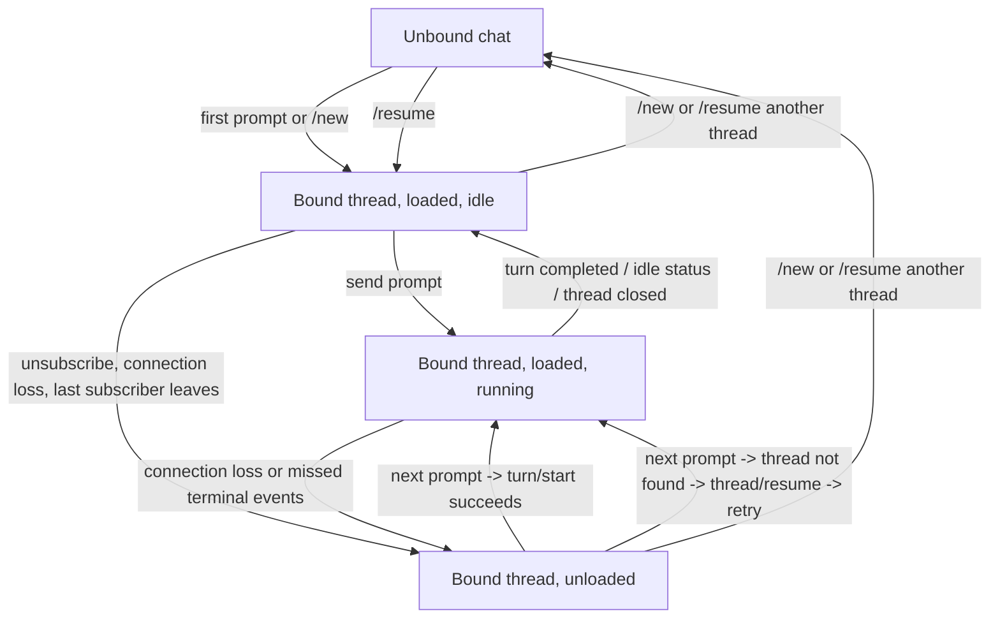

# Feishu Thread Lifecycle

Chinese version: `docs/feishu-thread-lifecycle.zh-CN.md`

This document defines the current thread lifecycle contract for the Feishu side.
It explains why Feishu must follow the same backend contract as `fcodex`, while
still using a different runtime recovery model.

See also:

- `docs/fcodex-shared-backend-runtime.md`
- `docs/shared-backend-resume-safety.md`
- `docs/session-profile-semantics.md`

## 1. Verified Baseline

- Upstream project: [`openai/codex`](https://github.com/openai/codex.git)
- Locally verified baseline: `codex-cli 0.118.0` (2026-04-03)

## 2. Four States That Must Not Be Confused

For one Feishu chat, the following are different facts:

1. `binding`
   - which `thread_id` this Feishu chat is logically attached to
2. `subscription`
   - whether the current live connection is still subscribed to that thread
3. `loaded runtime`
   - whether the thread is currently loaded in app-server memory
4. `running turn`
   - whether a turn is currently executing

The Feishu implementation uses `binding` as the chat-local source of truth.
`loaded runtime` is a recoverable runtime fact, not the binding fact.

## 3. Why Feishu Cannot Copy `fcodex` Literally

`fcodex` normally keeps one live remote session while the TUI process stays
open. That means:

- the websocket stays connected
- the current thread often stays subscribed
- the thread often remains loaded

Feishu is different:

- the Feishu user is not holding a long-lived TUI process
- the service-side remote connection can be interrupted independently
- a bound thread may become unloaded even though the Feishu chat should still
  continue that same thread later

Therefore Feishu must preserve the thread binding even after runtime loss, then
re-load the runtime when needed.

## 4. Feishu State Diagram

## 5. Runtime Recovery Rules

### 5.1 Binding Survives Unload

If app-server unloads a thread because the last subscriber disappears, the
Feishu chat must keep:

- `current_thread_id`
- `current_thread_name`
- chat-local working directory and UI state

It must not treat `thread/closed` or `turn/start -> thread not found` as proof
that the logical chat binding should be cleared.

### 5.2 `thread/closed` Means Runtime Ended, Not Session Deleted

Upstream `thread/closed` is emitted after the thread is unloaded from memory.
It does not mean the persisted rollout vanished. A later `thread/resume` can
still restore it.

### 5.3 Next Prompt Rehydrates the Runtime

When a Feishu chat already has a bound `thread_id`:

1. try `turn/start`
2. if app-server says `thread not found`, call `thread/resume`
3. retry `turn/start` once on the resumed thread

This mirrors the upstream contract while adapting to Feishu's weaker
connection-liveness assumptions.

### 5.4 Online Notifications Are Best-Effort

While Feishu is still subscribed, it uses live notifications for:

- streaming reply deltas
- command/file change logs
- approval requests
- terminal events

But terminal notifications can be missed after disconnects or ownership
transfers. Therefore the Feishu side also reconciles from `thread/read`:

- when terminal signals arrive
- when `thread/closed` arrives
- when a watchdog notices a running card has gone quiet for too long

## 6. Relationship With `fcodex`

`fcodex` and Feishu still share the same backend contract:

- same shared app-server
- same persisted thread ids
- same `thread/resume` / `turn/start` semantics

What differs is only the client-side runtime model:

- `fcodex` usually stays attached while the TUI is alive
- Feishu must recover from a bound-but-unloaded state more often

So the rule is:

- same protocol contract
- different front-end recovery strategy

## 7. Implementation Contract

Current Feishu-side implementation should satisfy all of these:

- one Feishu chat keeps one logical current thread binding
- group chats share binding by `chat_id`
- runtime loss does not clear binding automatically
- `/new` and `/resume` explicitly replace the binding
- if runtime is gone, the next prompt rehydrates it from the bound
  `thread_id`
- `thread/closed` is handled as a runtime transition, not a logical unbind

## 8. Relevant Files

- `bot/codex_handler.py`
- `bot/adapters/codex_app_server.py`
- `bot/fcodex.py`
- `bot/fcodex_proxy.py`
- `docs/fcodex-shared-backend-runtime.md`
- `docs/shared-backend-resume-safety.md`
